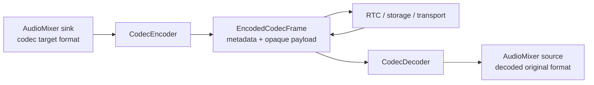
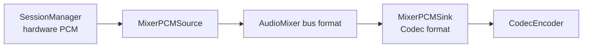

# Codec 仕様

`Codec` は `AudioCore.PCMFrame` と encoded payload を相互変換する Swift Package である。PCM の format 変換は行わない。

この仕様書は利用者が外部I/Oを理解し、改修者が codec 追加や payload 変更の影響範囲を判断できることを目的とする。

## Package Profile

| 項目 | 仕様 |
|---|---|
| パス | `RideIntercom/packages/Audio/Codec` |
| Product | `Codec` library |
| 依存 | `AudioCore` |
| 実装基盤 | `Foundation`, `AVFAudio`, `AudioToolbox`, `AVAudioConverter` |
| 対応プラットフォーム | iOS `26.4` 以降、macOS `26.4` 以降 |
| Swift | Swift `6` |
| テスト | Swift Testing の SwiftPM テスト |

## Boundary

| 持つ | 持たない |
|---|---|
| `PCMFrame -> EncodedCodecFrame` | resample |
| `EncodedCodecFrame -> PCMFrame` | channel mix |
| codec identifier | gain / volume |
| codec option / bit rate | mixer routing |
| encode / decode availability | packet envelope / encryption / jitter |
| fallback runtime report | WebRTC native codec negotiation |
| payload validation | hardware capture / render |



## Public Contract

| 型 | 種別 | 外部仕様 |
|---|---|---|
| `AudioCodec` | facade | `CodecEncoder` と `CodecDecoder` をまとめ、configuration適用時に `CodecRuntimeReport` を更新する |
| `CodecEncoder` | class | `CodecEncodingConfiguration.format` と一致する `PCMFrame` だけ encode する |
| `CodecDecoder` | class | `EncodedCodecFrame.codec` から decode 経路を選び、`EncodedCodecFrame.format` の `PCMFrame` を返す |
| `CodecEncodingConfiguration` | struct | encode codec、入力 `AudioFormat`、codec option を持つ |
| `EncodedCodecFrame` | struct | sequence、codec、format、timestamp、sample count、bit rate、payload、`EncodedAudioMetadata` を持つ |
| `CodecRuntimeReport` | struct | requested / active configuration、available codecs、selected codec、fallback有無を持つ |
| `CodecSupport` | enum | 現在環境で codec encode / decode が可能かを返す |
| `CodecIdentifier` | enum | `pcm16`, `mpeg4AACELDv2`, `opus` を表す |
| `PCM16Codec` | enum | PCM16 の pure Swift encode / decode helper |
| `CodecError` | enum | format不一致、payload不正、availability失敗、AudioConverter失敗を外部出力する |

PCM の共通型は `AudioCore.AudioFormat` と `AudioCore.PCMFrame` だけを使う。Codec package 固有のPCM型は作らない。

## External I/O

| 外部入力 | 正常出力 | エラー出力 | 保証 |
|---|---|---|---|
| `CodecEncodingConfiguration` | `CodecRuntimeReport` | なし | requested と active codec を分けて返す |
| `AudioCodec.apply(configuration)` | `runtimeReport` 更新 | なし | availability解決後の active configuration を encoder に適用する |
| `CodecEncoder.encode(PCMFrame)` | `EncodedCodecFrame` | `CodecError` | metadata と payload を生成する |
| `CodecDecoder.decode(EncodedCodecFrame)` | `PCMFrame` | `CodecError` | encoded metadata の format で PCM を復元する |
| `CodecSupport.isEncodingAvailable` | `Bool` | なし | 現在環境で encoder生成可能かを返す |
| `CodecSupport.isDecodingAvailable` | `Bool` | なし | 現在環境で decoder生成可能かを返す |

```text
PCMFrame(format A)
  -> CodecEncoder(configuration.format A)
  -> EncodedCodecFrame(format A, opaque payload)
  -> CodecDecoder
  -> PCMFrame(format A)
```

## 対応 Codec

| `CodecIdentifier` | 表示名 | AudioToolbox format | encode | decode | payload |
|---|---|---|---|---|---|
| `pcm16` | PCM 16-bit | `kAudioFormatLinearPCM` | 常時対応 | 常時対応 | signed 16-bit little-endian bytes |
| `mpeg4AACELDv2` | MPEG-4 AAC-ELD v2 | `kAudioFormatMPEG4AAC_ELD_V2` | `AVAudioConverter` が対応する環境で対応 | `AVAudioConverter` が対応する環境で対応 | Codec専用 compressed envelope |
| `opus` | Opus | `kAudioFormatOpus` | `AVAudioConverter` が対応する環境で対応 | `AVAudioConverter` が対応する環境で対応 | Codec専用 compressed envelope |

| codec | 想定用途 | 運用上の注意 |
|---|---|---|
| `pcm16` | fallback、テスト基準、環境差を受けないpacket audio | bitrateは高い。低帯域transportでは別codecを検討する |
| `mpeg4AACELDv2` | Apple環境での低遅延音声候補 | availability は OS / SDK / 実行環境の AudioConverter 実装に依存する |
| `opus` | 低bitrate packet audio候補 | availability は OS / SDK / 実行環境の AudioConverter 実装に依存する |

`CodecSupport` は `AVAudioConverter` を生成できるかで availability を判定する。PCM16 は外部依存がないため常に available とする。

## Configuration

| 設定 | 型 | 既定値 | 正規化 | 使うcodec |
|---|---|---|---|---|
| `codec` | `CodecIdentifier` | `pcm16` | なし | 全codec |
| `format` | `AudioCore.AudioFormat` | `48_000Hz / mono` | `AudioFormat` の範囲正規化 | 全codec |
| `aacELDv2Options.bitRate` | `Int` | `24_000` | `12_000...128_000` | `mpeg4AACELDv2` |
| `opusOptions.bitRate` | `Int` | `32_000` | `6_000...128_000` | `opus` |

| format項目 | 範囲 | 備考 |
|---|---|---|
| sample rate | `8_000...96_000` | `AudioCore.AudioFormat` が範囲外入力を丸める |
| channel count | `1...2` | mono / stereo の interleaved samples |
| samples | `Float` | `PCMFrame.samples` は interleaved として扱う |

`CodecEncodingConfiguration.format` は encoder が受け入れるPCM formatである。入力frameと一致しない場合、Codecは変換せず `formatMismatch` を返す。

## Encode / Decode

| 処理 | 入力 | 出力 | 失敗 |
|---|---|---|---|
| PCM16 encode | `PCMFrame.samples` | signed little-endian `Data` | sample count不整合 |
| PCM16 decode | signed little-endian `Data` | `[Float]` | odd byte count |
| AAC / Opus encode | Float32 PCM buffer | compressed envelope `Data` | format生成失敗、encoder unavailable、conversion failed |
| AAC / Opus decode | compressed envelope `Data` | Float32 PCM samples | malformed payload、decoder unavailable、conversion failed |
| empty PCM | 空 samples | 空 payload または空 envelope | なし |
| empty compressed payload | 空 envelope | 空 samples | malformed envelope の場合は失敗 |

### PCM16

| 項目 | 仕様 |
|---|---|
| sample clamp | `-1.0...1.0` |
| 正値scale | `Int16.max` |
| 負値scale | `32_768` |
| endian | little-endian |
| invalid payload | byte count が `Int16` サイズで割り切れない場合は `invalidByteCount` |

### Compressed Envelope

| フィールド | 目的 |
|---|---|
| codec | payloadを作ったcodecを検証する |
| source sample count | decode後に元sample数へ切り詰める |
| source frame count | output buffer容量を決める |
| maximum packet size | compressed bufferを復元する |
| packet count | compressed packet数を復元する |
| packet descriptions | `AVAudioCompressedBuffer` の packet description を復元する |
| data | compressed bytes |

AAC / Opus の payload は raw compressed bytes ではない。Codec package 専用 envelope として transport し、外部decoderへ直接渡さない。

## Format Policy

| 項目 | 仕様 |
|---|---|
| 入力PCM型 | `AudioCore.PCMFrame` |
| encode format | `CodecEncodingConfiguration.format` |
| decode format | `EncodedCodecFrame.format` |
| encode mismatch | `CodecError.formatMismatch(expected:actual:)` |
| 暗黙変換 | 行わない |
| 変換するpackage | `AudioMixer` の source ingress / sink egress |



送信用formatは `MixerPCMSink(targetFormat:)` を `CodecEncodingConfiguration.format` と同じ値にして作る。Codec は最終確認だけを行う。

## Runtime Report

| フィールド | 意味 | 利用者の扱い |
|---|---|---|
| `requestedConfiguration` | 呼び出し側が要求した codec / format / option | Settings や Diagnostics に表示する |
| `activeConfiguration` | availability 解決後に実際に使う codec / format / option | encoderへ適用される設定として扱う |
| `availableCodecs` | 現在環境で encode と decode が成立する codec | codec選択UIやfallback診断に使う |
| `selectedCodec` | encode に使う codec | RTC metadataやDiagnosticsへ渡す |
| `isFallback` | requested codec と selected codec が違う場合に `true` | UI通知やログに使う |

`CodecRuntimeReport` は Codec package の判断だけを表す。RTC route、Mixer graph、hardware状態は推測しない。

## RTC Boundary

| 項目 | Codec | RTC |
|---|---|---|
| codec実装 | encode / decode を行う | codec identifier と payload を運ぶ |
| payload | `EncodedCodecFrame.payload` を生成 / 解釈する | opaque `Data` として扱う |
| format | `AudioCore.AudioFormat` を encoded metadata に保持する | `RTCAudioFormat` として通信metadataに保持する |
| bit rate | codec option と encoded metadata に保持する | 通信上の希望や制約として運ぶ |
| drop判断 | decode失敗を `CodecError` として返す | unsupported codec、duplicate、expired、decrypt failure を扱う |

WebRTC route-managed media は native WebRTC 側の codec negotiation を使うため、この package の encode / decode 経路を通らない。

## Error I/O

| Error | 発生条件 | 呼び出し側の扱い |
|---|---|---|
| `invalidSampleCount` | samples 数が channel count で割り切れない | frame生成元を修正し、対象frameを破棄する |
| `formatMismatch` | encoder設定formatと `PCMFrame.format` が一致しない | `MixerPCMSink` target format か codec設定を修正する |
| `invalidByteCount` | PCM16 payload の byte count が不正 | packet破損として破棄する |
| `invalidFormat` | `AVAudioFormat` を作れない | `AudioFormat` 設定を修正する |
| `unsupportedCodec` | package が扱わない codec | codec policy を修正する |
| `encoderUnavailable` | 現在環境で encoder を作れない | `CodecRuntimeReport` を確認し、別codecへ切り替える |
| `decoderUnavailable` | 現在環境で decoder を作れない | 受信frameを破棄し、Diagnosticsへ出す |
| `audioFormatCreationFailed` | compressed / PCM format生成に失敗 | codecとformatの組み合わせを見直す |
| `malformedPayload` | compressed payload envelope を読めない | packet破損または互換性不一致として破棄する |
| `conversionFailed` | codec encode / decode の AudioConverter 失敗 | frameを破棄し、必要ならfallbackする |

エラーはI/Oである。`CodecError` は呼び出し側が握りつぶす内部例外ではなく、packet drop、Diagnostics、fallback判断へ渡す外部出力として扱う。

## 改修者向け判断表

| 変更内容 | 変更する場所 | 同時に更新する仕様 |
|---|---|---|
| codec identifierを追加 | `CodecIdentifier` | 対応Codec、Configuration、Runtime Report、Test Matrix |
| AudioToolbox formatを変更 | `CodecIdentifier.audioFormatID` | 対応Codec、Payload Specification |
| compressed payload envelopeを変更 | `CompressedPayloadEnvelope` | Payload Specification、Error I/O、互換性テスト |
| bit rate optionを追加 | option struct と `CodecEncodingConfiguration` | Configuration、Runtime Report |
| format変換を入れたくなった | 変更しない。`AudioMixer` に置く | Format Policy |
| RTC metadataを変えたくなった | `RTC` 側で扱う | RTC Boundary |

## Test Matrix

| 観点 | 確認 |
|---|---|
| codec identifier | PCM16 / AAC-ELD v2 / Opus が期待する AudioToolbox format ID を持つ |
| default configuration | PCM16 / `48_000Hz` / mono / AAC `24kbps` / Opus `32kbps` |
| option normalization | AAC / Opus bit rate が範囲内へ丸められる |
| AudioCore frame | sequence、format、timestamp、sample count を encoded metadata に保持する |
| format mismatch | 暗黙変換せず拒否する |
| PCM16 encode | signed little-endian、clamp、round trip |
| PCM16 decode | odd byte payload を拒否する |
| compressed payload | Codec envelope ではない payload を拒否する |
| runtime report | requested / active / fallback / availability を保持する |

実 AudioConverter による AAC / Opus の音質、遅延、availability は環境差があるため、単体テストでは固定しない。利用環境ごとの品質と遅延は統合経路または実機検証で確認する。
