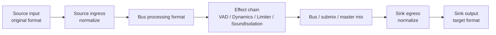
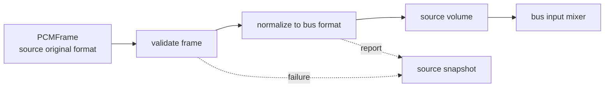
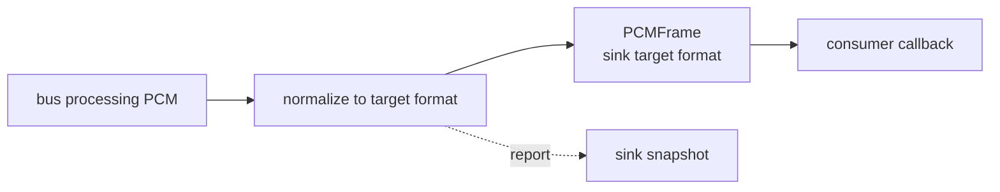
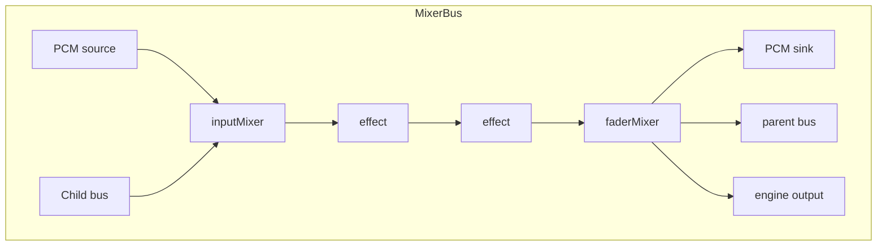

# AudioMixer 仕様

`AudioMixer` は送信と受信で同じ形に使う PCM graph package である。format差、peer差、effect配置、音量、mix、最終出力をここで吸収する。

この仕様書は、利用者が mixer graph を安全に組み立て、改修者が format 正規化や graph 変更の影響範囲を判断できることを目的とする。

## Package Profile

| 項目 | 仕様 |
|---|---|
| パス | `RideIntercom/packages/Audio/AudioMixer` |
| Product | `AudioMixer` library |
| 依存 | `AudioCore` |
| 実装基盤 | `AVFAudio`, `AVAudioEngine`, `AVAudioMixerNode` |
| 対応プラットフォーム | iOS `26.4` 以降、macOS `26.4` 以降 |
| Swift | Swift `6` |
| テスト | Swift Testing の SwiftPM テスト |

## Boundary

| 持つ | 持たない |
|---|---|
| PCM source / sink | Audio Session |
| source ingress正規化 | hardware capture / render |
| sink egress正規化 | codec encode / decode |
| bus graph / submix / master mix | RTC route / packet / encryption |
| effect chain | OS voice processing |
| source / bus / master volume | AudioCoreのPCM語彙定義 |

## Background

RideIntercom の音声経路では、送信と受信の両方で次の差分が同時に発生する。

| 差分 | 発生元 | Mixerで吸収する理由 |
|---|---|---|
| sample rate差 | hardware input、decoded packet、codec target、output hardware | effect chain と bus mix を安定したformatで動かすため |
| channel count差 | mono mic、stereo output、peer packet | sourceごとの違いを bus へ持ち込まないため |
| peer別音量 | remote peer、local monitor | transportやcodecではなく音声graphの状態だから |
| effect順序 | VAD、Dynamics、Limiter、SoundIsolation | effectはbus processing format上でないと結果が安定しないため |
| send / receive差 | capture send、receive output | 特別APIを増やさず、source/bus/sink構成の違いで表すため |

`SessionManager` が hardware format を偽装して変換すると、OS/device差分と音声graph差分が混ざる。`Codec` が暗黙変換すると、codec失敗とformat吸収が混ざる。`RTC` が変換するとDSP責務が通信へ漏れる。そのため、PCMの正規化とmixは `AudioMixer` に集約する。

## Design Principles

| 原則 | 仕様 |
|---|---|
| 対称性 | 送信と受信は同じ `MixerPCMSource -> MixerBus -> MixerPCMSink` で表す |
| bus format固定 | effect chain と mix は bus processing format だけで動く |
| ingress / egress分離 | source input と sink output のformat差を別々にreportする |
| source単位診断 | peerやcapture sourceの失敗はsource snapshotへ閉じる |
| sink単位診断 | outputやsend sinkの失敗はsink snapshotへ閉じる |
| App推測禁止 | Appは graph を推測せず `AudioMixerSnapshot` を読む |

## Format Lifecycle

| 段階 | format | 仕様 |
|---|---|---|
| source input | source original format | `SessionManager` や `Codec` が出したまま受け取る |
| source ingress | bus processing format | `AudioMixer` が sample rate / channel count を正規化する |
| bus / effect chain | bus processing format | Effectors、source volume、bus mix、master mix を同じformatで動かす |
| sink egress | sink target format | `SessionManager output` や `Codec encoder` が要求するformatへ正規化する |

```text
MixerPCMSource(original PCM)
  -> ingress normalize
  -> bus processing format
  -> effects / volume / mix
  -> egress normalize
  -> MixerPCMSink(target PCM)
```

Effect chain は source original format では動かさない。hardware format でしか意味がない処理は `SessionManager` に置く。



## External Specification

| 外部入力 | 正常出力 | エラー出力 | 保証 |
|---|---|---|---|
| `AudioMixer(format:)` | mixer instance | `formatCreationFailed` | bus processing format を固定する |
| `createBus(id)` | `MixerBus` | `emptyBusID` | bus id を mixer内で一意にする |
| `MixerBus.addPCMSource(id:)` | `MixerPCMSource` | `invalidNodeID`, `duplicateNodeID` | source id を bus 内で一意にする |
| `MixerPCMSource.schedule(frame)` | source snapshot / scheduled frame | source `lastFailure`, `AudioProcessingReport.failed` | source original format を保持し、bus formatへ正規化して投入する |
| `MixerBus.installPCMSink(id:targetFormat:onFrame:)` | `MixerPCMSink` と callback frame | sink `lastFailure`, `AudioProcessingReport.failed`, `pcmSinkInstallFailed` | bus format から target format へ正規化して callback へ出す |
| `MixerBus.addEffect(...)` | effect chain更新 | `incompatibleEffectNode`, `invalidNodeID`, `duplicateNodeID` | effect順序を snapshot と graph に保持する |
| `route(child, to: parent)` | route snapshot更新 | `unknownBus`, `invalidRoute`, `busAlreadyRouted`, `cycleDetected` | bus routingをDAGとして保つ |
| `routeToOutput(bus)` | output route snapshot更新 | `unknownBus`, `busAlreadyRouted` | v1では最終output busをひとつにする |
| `snapshot()` | `AudioMixerSnapshot` | なし | source / sink / route / graph を同じ粒度で診断できる |

## Source I/O

| 項目 | 仕様 |
|---|---|
| 入力型 | `AudioCore.PCMFrame` |
| 入力format | source original format。sourceごと、frameごとに異なってよい |
| 内部出力 | bus processing format の PCM |
| 正規化 | sample rate と channel count を bus processing format へ合わせる |
| 音量 | `MixerPCMSource.volume` で source単位に適用する |
| 失敗出力 | `MixerSourceSnapshot.lastFailure` と `normalizationReport` |
| 成功出力 | `scheduledFrameCount` の更新 |



## Sink I/O

| 項目 | 仕様 |
|---|---|
| 入力型 | bus processing format の PCM |
| 出力型 | `AudioCore.PCMFrame` |
| 出力format | sink target format。consumerごとに異なってよい |
| consumer例 | `CodecEncoder`、`SessionManager output`、monitor、test harness |
| 正規化 | bus processing format から sink target format へ合わせる |
| 失敗出力 | `MixerSinkSnapshot.lastFailure` と `normalizationReport` |
| 成功出力 | `emittedFrameCount` の更新と callback frame |



```text
external caller
  -> create bus
  -> attach source / sink / effects
  -> start mixer
  -> schedule or receive PCM
  -> inspect snapshot
```

## External Guarantees

| 項目 | 保証 |
|---|---|
| send/receive対称性 | capture send と receive output を同じ source/bus/sink 構造で表す |
| format吸収 | sample rate / channel count 差は source ingress と sink egress で吸収する |
| report | 正規化の成否を `AudioProcessingReport` と `lastFailure` で外へ出す |
| isolation | `SessionManager`、`Codec`、`RTC` の型を public API に要求しない |
| realtime姿勢 | source scheduling failure は graph全体を壊さず source単位で診断する |

## Symmetric Flows

| flow | graph |
|---|---|
| capture send | `SessionManager input actual PCM -> MixerPCMSource -> capture bus effects -> MixerPCMSink(send format) -> Codec -> RTC` |
| receive output | `RTC -> Codec -> peer MixerPCMSource -> peer/master effects -> MixerPCMSink(output hardware format) -> SessionManager output` |
| local monitor | capture source / bus を monitor bus または output sink へ route する |

送信だけ、受信だけの特別な mixer API は作らない。違いは source、bus、sink の組み方だけで表す。

## 推奨 Bus 構成

| bus | 入力source | effect例 | sink / route |
|---|---|---|---|
| `capture` | `SessionManager input actual PCM` | VAD、Dynamics、SoundIsolation | send sink、local monitor route |
| `peer:<peerID>` | decoded peer PCM | peer用Dynamics、peer volume | receive master route |
| `receiveMaster` | peer buses | master limiter | output sink |
| `monitor` | capture bus or selected source | limiter | output sink |

上表は RideIntercom の構成例である。別Appでは必要なbusだけを作る。`AudioMixer` は bus名に意味を持たず、snapshot ID として扱う。

## Public Contract

| 型 | 契約 |
|---|---|
| `AudioMixer` | `AVAudioEngine`、bus作成、routing、output接続、snapshot を管理する |
| `MixerBus` | source、sink、effect chain、bus volume、route を管理する |
| `MixerPCMSource` | 任意formatの `PCMFrame` を bus processing format に正規化して graph へ入れる |
| `MixerPCMSink` | bus processing format の PCM を target format に正規化して emit する |
| `AudioMixerSnapshot` | bus、source、sink、effect、route、graph を診断する |
| `MixerSourceSnapshot` | source original format、mixer format、scheduled count、normalization report、last failure を持つ |
| `MixerSinkSnapshot` | mixer format、target format、emitted count、normalization report、last failure を持つ |
| `MixerEffectSnapshot` | effect id、型名、順序、状態、表示用parameterを持つ |
| `MixerGraphSnapshot` | node / edge として現在の信号経路を表す |

## Graph Contract

```text
source nodes / child buses
  -> input mixer
  -> effect chain
  -> fader mixer
  -> sinks / parent bus / engine output
```

| 要素 | 役割 |
|---|---|
| source node | capture PCM、decoded peer PCM、test PCM の入口 |
| input mixer | source と child bus の合流点 |
| effect chain | VAD、Dynamics、Limiter、SoundIsolation などを順序付きに接続する |
| fader mixer | bus volume、sink tap、parent/output route の起点 |
| sink node | send PCM、output PCM、monitor PCM の出口 |



## Snapshot Graph

| node kind | ID形式 | 意味 |
|---|---|---|
| `source` | `bus:<busID>:source:<sourceID>` | PCM source node |
| `busInput` | `bus:<busID>:input` | source と child bus の合流点 |
| `effect` | `bus:<busID>:effect:<effectID>` | effect chain node |
| `busFader` | `bus:<busID>:fader` | bus volume と route の起点 |
| `sink` | `bus:<busID>:sink:<sinkID>` | PCM sink node |
| `output` | `mixer:output` | engine output |

| edge kind | 接続 |
|---|---|
| `sourceToBusInput` | source -> bus input |
| `busSignal` | bus input -> effects -> fader |
| `busToSink` | fader -> sink |
| `busRoute` | child bus fader -> parent bus input |
| `outputRoute` | final bus fader -> engine output |

graph はUI専用ではない。packageが現在の信号経路を説明するための診断データである。描画側やAppは node/edge をそのまま使い、App固有の推測で経路を補完しない。

## Volume Ownership

| 操作値 | 所有 |
|---|---|
| source volume | `MixerPCMSource.volume` |
| peer volume | peer別 `MixerPCMSource.volume` |
| bus volume | `MixerBus.volume` |
| master volume | master bus の `MixerBus.volume` |
| gain / limiter | Effectors を `MixerBus.addEffect` で挿入する |
| signal measurement | `AudioCore.AudioSignalMeter` |

## Runtime Snapshot

| snapshot | 必須情報 |
|---|---|
| source | original format、mixer format、scheduled frame count、normalization report、last failure |
| sink | mixer format、target format、emitted frame count、normalization report、last failure |
| bus | source count、sink count、effect count、effect chain |
| graph | source、bus input、effect、bus fader、sink、output の node / edge |

snapshot は Codable とし、RTC runtime package report へ載せられる。

## Snapshotの読み方

| 見たいこと | 読む場所 | 判断 |
|---|---|---|
| peerごとの入力format | `MixerSourceSnapshot.originalFormat` | RTC受信やCodec decodeのformat多様性を確認する |
| bus処理format | `MixerSourceSnapshot.mixerFormat`, `MixerSinkSnapshot.mixerFormat` | effect chain が動くformatを確認する |
| output/codec向けformat | `MixerSinkSnapshot.targetFormat` | `SessionManager` や `Codec` が要求するformatに合っているか確認する |
| source正規化成否 | `MixerSourceSnapshot.normalizationReport` | source ingressの変換有無と失敗を確認する |
| sink正規化成否 | `MixerSinkSnapshot.normalizationReport` | sink egressの変換有無と失敗を確認する |
| graph接続 | `MixerGraphSnapshot.nodes/edges` | route、effect順序、sink接続を確認する |
| effect状態 | `MixerEffectSnapshot.state/parameters` | Effectors側のruntime状態を表示する |

## Routing Constraints

| 制約 | 仕様 | エラー出力 |
|---|---|---|
| 空ID禁止 | bus/source/effect/sink id は空にしない | `emptyBusID`, `invalidNodeID` |
| ID重複禁止 | 同じbus内のsource/effect/sink id は重複しない | `duplicateNodeID` |
| 管理外bus禁止 | route対象は同じ `AudioMixer` が作成したbusだけ | `unknownBus` |
| 複数親禁止 | ひとつのbusは親busまたはoutputへ一度だけ送る | `busAlreadyRouted` |
| 循環禁止 | `A -> B -> C -> A` を作らない | `cycleDetected` |
| sink-only node禁止 | effect chainにsink専用nodeを入れない | `incompatibleEffectNode` |

## Error I/O

| エラー出力 | 発生条件 | 外部から見える場所 |
|---|---|---|
| `formatCreationFailed` | AudioCore `AudioFormat` から `AVAudioFormat` を作れない | throw |
| `pcmSourceScheduleFailed` | source frameをbus formatへ正規化またはbuffer化できない | source `lastFailure`, normalization report |
| `pcmSinkInstallFailed` | sink tap / callback setupに失敗 | throw |
| `AudioProcessingReport.failed` | source ingress / sink egress の正規化失敗 | source / sink snapshot |
| routing系error | graph制約違反 | throw |

エラーはI/Oである。AppやDiagnosticsは throw だけでなく、snapshot上の `lastFailure` と `normalizationReport` を読む。

## External State

| 状態 | 外部から観測できる値 |
|---|---|
| stopped | engine未開始、graph snapshot取得可能 |
| running | source schedule / sink callback が有効 |
| source failure | source `lastFailure` と normalization report |
| sink failure | sink `lastFailure` と normalization report |
| graph changed | `AudioMixerSnapshot.graph` の node / edge |

## 改修者向け判断表

| 変更したいこと | 変更する場所 | 変更してはいけない場所 | 同時に更新する仕様 |
|---|---|---|---|
| source inputの受け口を増やす | `MixerPCMSource` | `SessionManager`, `RTC` | Source I/O, Snapshotの読み方 |
| sink outputのconsumerを増やす | `MixerPCMSink` | `Codec`, `SessionManager` | Sink I/O |
| sample rate変換を改善する | AudioMixer内の正規化処理 | `AudioCore`, `Codec`, `RTC` | Format Lifecycle, Error I/O |
| channel count変換を改善する | AudioMixer内の正規化処理 | `AudioCore`, `SessionManager` | Format Lifecycle, Test Matrix |
| effect状態を増やす | `MixerEffectSnapshot` と Effectors側snapshot | `RTC` | Public Contract, Snapshotの読み方 |
| route制約を変える | `AudioMixer.route` / graph snapshot | App | Routing Constraints, Snapshot Graph |
| peer volume仕様を変える | `MixerPCMSource.volume` | `RTC` | Volume Ownership |
| master limiterを変える | Effectors + bus構成 | `SessionManager`, `Codec` | 推奨Bus構成 |

## Test Matrix

| 観点 | 確認 |
|---|---|
| source ingress | mixed sample rate / channel count の PCM を bus format へ正規化する |
| sink egress | bus format の PCM を target format へ正規化する |
| symmetry | source と sink が同じ粒度の report / failure を持つ |
| graph | source / sink / effect / route が node / edge として診断できる |
| effect | effect chain が bus processing format 上に接続される |
| route constraints | 管理外bus、複数親、循環routeを拒否する |
| snapshot diagnostics | source/sink/effect/graphの外部観測値が欠落しない |
