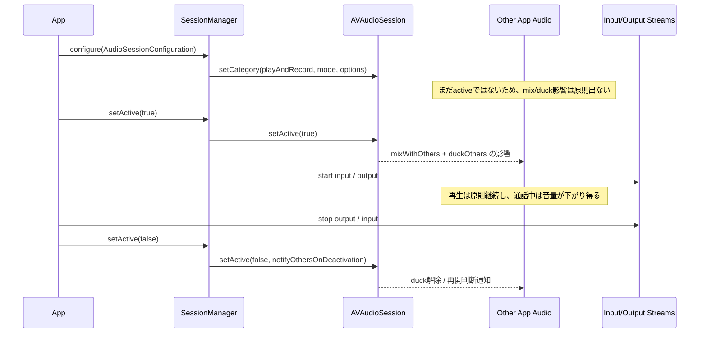
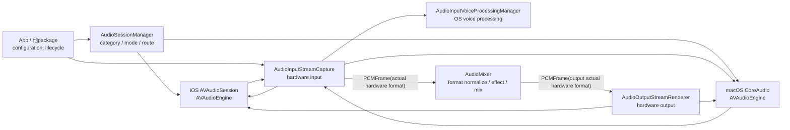
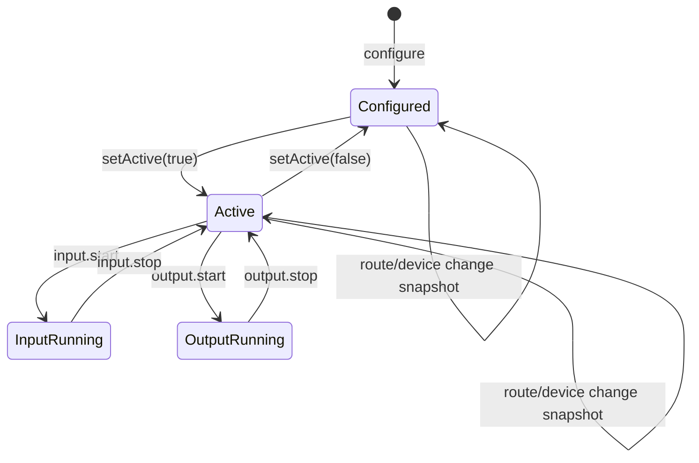
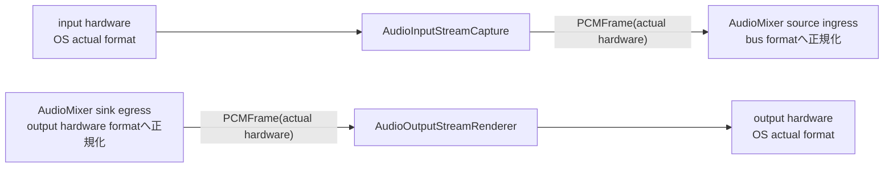

# SessionManager 仕様

`SessionManager` は OS audio session と audio hardware の境界を扱う package である。入力された PCM を変換せず、出力する PCM も変換しない。sample rate、channel count、volume、gain、effect、mix の吸収は `AudioMixer` が担当する。

## Package Profile

| 項目 | 仕様 |
|---|---|
| パス | `RideIntercom/packages/Audio/SessionManager` |
| Product | `SessionManager` library |
| 依存 | `AudioCore` |
| 使用する共通型 | `AudioFormat`, `PCMFrame` |
| 実装基盤 | `AVFAudio`, iOS `AVAudioSession`, macOS `CoreAudio` |
| 対応プラットフォーム | iOS `26.4` 以降、macOS `26.4` 以降 |
| Swift | Swift `6` |
| テスト | fake backend による SwiftPM テスト。実マイク / 実スピーカーに依存しない |
| 移植単位 | `SessionManager` と `AudioCore` だけで他アプリへ移植できる |

## 最初に読む結論

| 利用者 / 改修者が知りたいこと | 現在の結論 | 根拠になる実装 | 変更時の注意 |
|---|---|---|---|
| 標準で他アプリ音声は止まるか | 原則止まらない。`mixWithOthers` で混ぜる | `AudioSessionConfiguration.resolved()` が `.mixWithOthers` を常に入れる | 外すと Music / Podcast / Navigation を止める体験へ変わり得る |
| 標準で他アプリ音声は小さくなるか | session active 中は小さくなり得る。`duckOthers` を標準ONにする | `resolved()` が `.duckOthers` を常に入れる | 外すと通話音声と他アプリ音声が競合しやすい |
| advanced ducking の強さを細かく指定できるか | できる。`.systemDefault`, `.minimum`, `.medium`, `.maximum` を指定する | `AudioSessionDuckingLevel` を `AVAudioVoiceProcessingOtherAudioDuckingConfiguration.Level` へ写像する | `otherAudioDuckingEnabled == false` のときはlevel指定を使わない |
| 通話終了後に利用者の再生操作が必要か | 原則不要。mixされている音声は継続し、duckはdeactivateで解除される | iOSの `setActive(false)` は `.notifyOthersOnDeactivation` 付き | 他アプリやOSがpauseした場合の再開は保証しない |
| `configure` だけで他アプリ音声へ影響するか | 原則影響しない。設定を解決して適用するだけ | `configure` は category / route希望を適用し、active化しない | 実際のmix / duck影響は `setActive(true)` で出る |
| speaker既定時にecho希望が自動でtrueになる理由 | speaker出力はマイクへ回り込みやすいため、default modeでは通話品質側へ倒す | `resolvedPrefersEchoCancelledInput = prefersEchoCancelledInput || defaultToSpeaker` | PCM処理ではない。resample / gain / noise reduction はしない |
| `voiceChat` と explicit echo希望を併用しない理由 | mode由来の挙動と明示preferenceの適用点が競合するため止める | `mode == .voiceChat && prefersEchoCancelledInput` で throw | 暗黙解決しない。呼び出し側がどちらを使うか選ぶ |
| 終了時にstreamを自動停止するか | しない。呼び出し側が output / input stream を止めてから deactivate する | `AudioSessionManager.setActive(false)` は session だけを扱う | 自動停止を入れると SessionManager が stream lifecycle を所有してしまう |

## Activation Diagram



## 実装対応表

| 実装箇所 | 実装している仕様 | 利用者への意味 | 改修者への意味 |
|---|---|---|---|
| `AudioSessionConfiguration.resolved()` の標準options | `.allowBluetoothA2DP`, `.allowBluetoothHFP`, `.bluetoothHighQualityRecording`, `.duckOthers`, `.farFieldInput`, `.mixWithOthers`, `.overrideMutedMicrophoneInterruption` を入れる | Bluetooth、他アプリ音声共存、duck、hardware mute準異常系を標準で扱う | optionを消す変更は体験変更。仕様表とテスト更新が必要 |
| `defaultToSpeaker` 分岐 | 明示時だけ `.defaultToSpeaker` を追加する | speaker出力に寄せたいときだけroute希望を強める | 常時ONにすると receiver / accessory route 体験が変わる |
| `resolvedPrefersEchoCancelledInput` | default mode では `prefersEchoCancelledInput || defaultToSpeaker` | speaker利用時にecho-cancelled input希望を自動補完する | `voiceChat` では `nil` にして session preference 操作を出さない |
| `AudioInputVoiceProcessingConfiguration.duckingLevel` | advanced ducking level を4段階で保持する | 通話音声優先度を利用場面ごとに調整できる | `otherAudioDuckingEnabled == false` では `.systemDefault` として無効化する |
| `mode == .voiceChat && prefersEchoCancelledInput` | 設定矛盾として throw する | 曖昧なecho設定を通さない | modeとpreferenceを暗黙mergeしない |
| `AudioSessionManager.configure` | apply -> input -> output -> echo preference -> snapshot の順で実行する | route希望と結果を operation report で確認できる | 途中の継続可能失敗で全体を壊さず、operation単位で返す |
| `SystemAudioSessionBackend.setActive(false)` | `.notifyOthersOnDeactivation` を付ける | 他アプリが再開判断できる通知をOSへ出す | 再生再開そのものは他アプリ / OS責務として残す |

## Background

| iOS / macOS の複雑さ | package が吸収する内容 | 呼び出し側へ出す情報 |
|---|---|---|
| iOS は `category`, `mode`, `options`, route override, echo-cancelled input preference の組み合わせで挙動が変わる | `AudioSessionConfiguration.resolved()` で矛盾を検出し、適用順を固定する | 要求設定、解決後設定、操作結果 |
| iOS は任意の output device ID を直接選べず、speaker / receiver override が中心になる | `AudioSessionDeviceSelection` を platform ごとの実操作へ変換する | 非対応selection、未検出deviceの操作結果 |
| macOS は `AVAudioSession` ではなく CoreAudio default device を扱う | 同じ selection API で CoreAudio default input / output を切り替える | device一覧、default input / output snapshot |
| OS voice processing は input node / route に結び付く | `AudioInputVoiceProcessingConfiguration` を input boundary で適用する | voice processing operation report |
| hardware format は route / device / OS が決める | preferred format と actual hardware format を分離する | stream snapshot の `preferredFormat` / `actualHardwareFormat` |
| route change は実行中に起きる | snapshot change event に正規化する | `AudioSessionSnapshotChange` |

## AVFAudio Session 仕様対応

| AVFAudio仕様 | 現在の実装 | 利用者への影響 | 改修者の判断 |
|---|---|---|---|
| `AVAudioSession` はアプリの音声意図をOSへ伝え、OSが他アプリ音声、route、hardwareを調整する | `AudioSessionConfiguration` を `ResolvedAudioSessionConfiguration` に解決し、iOSでは `AVAudioSession.setCategory` / `setActive` へ渡す | 呼び出し側はOS APIを直接扱わず、operation report と snapshot を見る | OSの挙動を隠すのではなく、解決後設定と結果を外へ返す |
| `playAndRecord` は録音と再生を扱う通話向けcategory。optionなしでは他の非mixable音声をinterruptし得る | categoryは常に `.playAndRecord`。同時に `.mixWithOthers` と `.duckOthers` を標準ONにする | 標準設定では、他アプリ音声を止めるのではなく、混ぜて音量を下げる方針になる | `.mixWithOthers` / `.duckOthers` を削る変更は、他アプリ音声を止める体験変更として扱う |
| `.mixWithOthers` は他アプリ音声とのmixを許可する | 標準ON | Music / Podcast / Navigation 等の再生を原則止めない | `duckOthers` が暗黙にmixを有効化しても、report上の明確さのため明示ONを維持する |
| `.duckOthers` はこのsessionがactiveな間、他アプリ音声の音量を下げる。duckはdeactivateで終わる | 標準ON | 通話中は他アプリ音声が小さくなり、`setActive(false)` 後に通常音量へ戻る | 「止めずに会話を優先する」ための設定。pause用途ではない |
| `.defaultToSpeaker` は `playAndRecord` でbuilt-in speakerを既定routeへ寄せる | `defaultToSpeaker == true` の場合だけ追加する | speaker出力に寄る。receiverや一部user gestureより強いroute希望になる | 常時ONにしない。speaker利用を明示した設定だけで使う |
| `voiceChat` mode はVoIP向けに音声EQやroute候補をvoice chat向けへ寄せる | `mode == .voiceChat` の場合だけ使う | route候補や音量感が標準modeと変わり得る | default modeで足りる場合は使わない。明示設定として扱う |
| `voiceChat` は voice processing I/O と組み合わせる前提が強い | input stream側で `AVAudioInputNode.setVoiceProcessingEnabled` 系を別途扱う | modeだけではPCM effect chainやMixer処理は増えない | session mode と input node voice processing を混同しない |
| `setActive(true)` でsession設定が実際に効き始める | `AudioSessionManager.setActive(true)` で呼ぶ | 他アプリ音声のmix / duck、route挙動はactive化で表面化する | configure と active を分け、開始タイミングを呼び出し側が制御する |
| `setActive(false, .notifyOthersOnDeactivation)` はdeactivate時に他sessionへ通知する | iOSでは `setActive(false, options: .notifyOthersOnDeactivation)` を呼ぶ | interruptされた他アプリが再開判断できる。ただし現在の標準設定はinterruptではなくmix / duckが主 | deactivation前にstream停止を済ませる。再生再開は他アプリとOSの責務で、packageは保証しない |

## 他アプリ音声影響マトリックス

| 状況 | 現在のpackage設定 | 他アプリ音声は止まるか | 利用者の再生操作が再度必要か | 補足 |
|---|---|---|---|---|
| Music / Podcast が再生中に `configure` だけ行う | category / mode / optionsを解決するだけ | 止まらない | 不要 | `configure` だけではsessionをactive化しない |
| Music / Podcast が再生中に `setActive(true)` する | `.playAndRecord` + `.mixWithOthers` + `.duckOthers` | 原則止まらない | 原則不要 | 通話中は音量が下がる。duckはsession active中の挙動 |
| 通話終了で `setActive(false)` する | `.notifyOthersOnDeactivation` 付きdeactivate | 既にmixされていた音声は継続する | 原則不要 | duckが解除され、他アプリ音声は通常音量へ戻る |
| 他アプリ音声が非mixableで、OSがmixを許可しない | packageはmix希望を出す | OS判断 | 場合による | 結果は `setActive(true)` の operation report で見る |
| 電話など高優先度sessionが存在する | `playAndRecord` sessionのactive化を試みる | package側では止めない | 場合による | OSが `insufficientPriority` 相当でactive化を拒否し得る |
| 将来 `.mixWithOthers` を外す | `.playAndRecord` の非mixable挙動へ寄る | 止まり得る | 必要になり得る | 現在仕様からの体験変更。実装前に仕様更新が必要 |
| 将来 `.duckOthers` を外して `.mixWithOthers` だけ残す | mixだけ許可する | 原則止まらない | 原則不要 | 他アプリ音声は下がらず、通話音声と競合しやすい |
| `interruptSpokenAudioAndMixWithOthers` を追加する | 現在は未採用 | spoken audioをpauseし得る | 必要になり得る | navigation prompt用途のoption。通話常用設定へ入れない |

## iOS利用者体験マトリックス

| 利用者に見える現象 | 現在の仕様 | packageが保証すること | packageが保証しないこと |
|---|---|---|---|
| 他アプリ音声が小さくなる | `duckOthers` による意図した挙動 | active中のduck希望をOSへ出す | 他アプリごとの音量変化量 |
| 他アプリ音声が止まらない | `mixWithOthers` による意図した挙動 | mix希望をOSへ出す | 高優先度sessionや他アプリ側policyを越えた保証 |
| 通話終了後に音量が戻る | `setActive(false)` でduck解除される | deactivateを呼び、通知optionを付ける | 他アプリが再生を再開するかどうか |
| speakerへ出る | `defaultToSpeaker == true` の場合だけ | `.defaultToSpeaker` optionを追加する | user gestureやaccessory routeを常に尊重すること |
| receiver / headset routeを優先する | `defaultToSpeaker == false` | speaker固定を避ける | OS route policyの完全制御 |
| voice chatらしいroute / 音声特性になる | `mode == .voiceChat` の場合だけ | voiceChat modeをOSへ渡す | Mixer effectやCodec処理の変更 |

## Boundary

| 持つ | 持たない |
|---|---|
| Audio Session configuration | resample |
| active / inactive 切替 | channel mix |
| input / output device selection | gain / volume |
| route / device snapshot | bus mix |
| hardware input capture | effect chain |
| hardware output render | VAD / limiter / dynamics |
| OS voice processing | codec encode / decode |
| platform差分の report 化 | RTC route / packet / encryption |

`SessionManager` は Mixer ではない。hardware format と consumer target format の差異は `AudioMixer` の source ingress / sink egress で吸収する。

## Package Boundary Diagram



## External Specification

| 外部入力 | 正常出力 | エラー出力 | 保証 |
|---|---|---|---|
| `AudioSessionConfiguration` | `AudioSessionConfigurationReport` | 設定矛盾は throw、OS差分は operation report | 要求値と解決後値を両方保持する |
| `setActive(Bool)` | `AudioSessionOperationReport` | `ignored` / `failed` report | active 切替結果を I/O として返す |
| `snapshot()` | `AudioSessionSnapshot` | throw | 現在の device / route を外へ出す |
| snapshot change handler | `AudioSessionSnapshotChange` | なし | route / device 変更を event として出す |
| `AudioInputStreamConfiguration` | input `AudioStreamOperationReport` | `ignored` / `failed` report | preferred と actual hardware format を分ける |
| input hardware callback | `AudioStreamRuntimeEvent.inputFrame(PCMFrame)` | frame生成不能時は drop | actual hardware PCM を変換せず通知する |
| `AudioOutputStreamConfiguration` | output `AudioStreamOperationReport` | `ignored` / `failed` report | output hardware format を snapshot に保持する |
| `schedule(PCMFrame)` | `outputFrameScheduled(PCMFrame)` | `hardwareFormatMismatch`, `invalidFrame`, `engineOperationFailed` | actual hardware format の frame だけ schedule する |
| `AudioInputVoiceProcessingConfiguration` | voice processing operation report | `unsupportedOnCurrentPlatform` | OS対応操作だけ適用し、非対応でも stream を壊さない |

## Audio Flow

| flow | 経路 | SessionManager の責務 |
|---|---|---|
| capture send | `hardware input -> SessionManager input -> AudioMixer source -> AudioMixer sink(send format) -> Codec -> RTC` | hardware actual PCM を出す |
| receive output | `RTC -> Codec -> AudioMixer source -> AudioMixer sink(output hardware format) -> SessionManager output -> hardware output` | hardware actual PCM だけ受け取る |
| local monitor | `hardware input -> SessionManager input -> AudioMixer source -> AudioMixer sink(output hardware format) -> SessionManager output` | input / output hardware 境界を維持する |

```text
input hardware -> SessionManager -> PCMFrame(actual hardware format) -> AudioMixer
AudioMixer -> PCMFrame(output actual hardware format) -> SessionManager -> output hardware
```

## Lifecycle



| 状態 | 外部観測 | 失敗時の扱い |
|---|---|---|
| 設定済み | 解決後設定、操作結果、snapshot | OS差分は operation report に残す |
| session有効 | `setActive(true)` の結果、現在device / route | iOS以外の active 操作は ignored として返す |
| input実行中 | actual hardware format、capture済みframe数、input frame event | voice processing 非対応でも capture start は継続する |
| output実行中 | actual hardware format、schedule済みframe数、schedule event | format不一致は変換せず reject report として返す |
| route変更後 | snapshot change event | snapshot取得不能時は event を出さない |
| 停止済み | already stopped report | 二重 stop は ignored として返す |

## Public Contract

| 型 | 契約 |
|---|---|
| `AudioSessionManager` | category、mode、active、device selection、route snapshot を扱う |
| `AudioSessionConfiguration` | 呼び出し側の希望を保持する |
| `ResolvedAudioSessionConfiguration` | OSへ渡す確定値を保持する |
| `AudioSessionConfigurationReport` | 要求設定、解決後設定、操作結果、snapshot をまとめる |
| `AudioSessionOperationReport` | session操作ごとの applied / ignored / failed を返す |
| `AudioSessionSnapshot` | active状態、利用可能device、現在deviceを返す |
| `AudioSessionRuntimeEvent` | session operation、configuration report、snapshot change を通知する |
| `AudioInputStreamCapture` | input tap、OS voice processing、actual hardware PCM 通知を扱う |
| `AudioOutputStreamRenderer` | output renderer、actual hardware PCM schedule を扱う |
| `AudioInputStreamConfiguration` | preferred hardware format、buffer frame count、voice processing希望を持つ |
| `AudioOutputStreamConfiguration` | preferred hardware format を持つ |
| `AudioStreamSnapshot` | preferred format、actual hardware format、running state、processed count を持つ |
| `AudioStreamOperationReport` | start / stop / voice processing / schedule の結果を持つ |
| `AudioStreamRuntimeEvent` | operation、input frame、output scheduled frame を通知する |

## Configuration Model

| 入力フィールド | 既定値 | 意味 | 注意 |
|---|---:|---|---|
| `mode` | `.default` | iOS `AVAudioSession.Mode` 相当の希望 | `.voiceChat` は明示的な echo-cancelled input 希望と併用しない |
| `defaultToSpeaker` | `false` | iOS speaker を既定出力に寄せる | `.defaultToSpeaker` option を追加し、default mode では echo-cancelled input も希望する |
| `prefersEchoCancelledInput` | `false` | iOS echo-cancelled input preference | `.default` mode のときだけ `setPrefersEchoCancelledInput` 対象になる |
| `preferredInput` | `.systemDefault` | 入力device希望 | 対象OSで選べない selection は ignored report として返す |
| `preferredOutput` | `.systemDefault` | 出力device希望 | iOS任意output deviceは unsupported selection として返す |

## 設定解決マトリックス

| 目的 | 呼び出しパラメーター | 解決後category | 解決後mode | 解決後options | 解決後echo preference | 結果 | package側の理由 |
|---|---|---|---|---|---|---|---|
| 標準通話 | `mode: .default`, `defaultToSpeaker: false`, `prefersEchoCancelledInput: false` | `.playAndRecord` | `.default` | 標準通話options | `false` | 有効 | 他アプリ音声と共存しつつ、明示されていないecho希望は増やさない |
| speakerを既定出力にする | `mode: .default`, `defaultToSpeaker: true`, `prefersEchoCancelledInput: false` | `.playAndRecord` | `.default` | 標準通話options + `.defaultToSpeaker` | `true` | 有効 | speaker出力は入力へ回り込みやすいため、package側で echo-cancelled input を希望値として補完する |
| default modeでecho-cancelled inputだけ希望する | `mode: .default`, `defaultToSpeaker: false`, `prefersEchoCancelledInput: true` | `.playAndRecord` | `.default` | 標準通話options | `true` | 有効 | `voiceChat` に切り替えず、sessionのecho preferenceだけを明示する |
| speaker既定かつecho希望 | `mode: .default`, `defaultToSpeaker: true`, `prefersEchoCancelledInput: true` | `.playAndRecord` | `.default` | 標準通話options + `.defaultToSpeaker` | `true` | 有効 | 呼び出し側の明示希望とspeaker由来の自動補完が同じ結果になる |
| voice chat modeを使う | `mode: .voiceChat`, `defaultToSpeaker: false`, `prefersEchoCancelledInput: false` | `.playAndRecord` | `.voiceChat` | 標準通話options | `nil` | 有効 | echo特性はmodeに任せ、`setPrefersEchoCancelledInput` は呼ばない |
| voice chat modeでspeaker既定にする | `mode: .voiceChat`, `defaultToSpeaker: true`, `prefersEchoCancelledInput: false` | `.playAndRecord` | `.voiceChat` | 標準通話options + `.defaultToSpeaker` | `nil` | 有効 | speaker route希望だけ追加し、echo preferenceはmodeに任せる |
| voice chat modeでecho preferenceも明示する | `mode: .voiceChat`, `prefersEchoCancelledInput: true` | なし | なし | なし | なし | throw | `voiceChat` と明示echo preferenceは適用点が競合するため設定矛盾として止める |
| device入力を希望する | `preferredInput: .device(id)` | `.playAndRecord` | `mode` の解決結果 | `defaultToSpeaker` の解決結果 | `mode` の解決結果 | 操作結果で判断 | deviceが存在するか、対象OSで選べるかはOS適用時に決まる |
| device出力を希望する | `preferredOutput: .device(id)` | `.playAndRecord` | `mode` の解決結果 | `defaultToSpeaker` の解決結果 | `mode` の解決結果 | 操作結果で判断 | iOSは任意output deviceを直接選ばず、macOSはCoreAudio default outputを変更する |

## Echo Preference 自動解決ルール

| 条件 | packageが補完する値 | OSへ出す操作 | 理由 | PCM処理への影響 |
|---|---|---|---|---|
| `mode == .default`, `defaultToSpeaker == true`, `prefersEchoCancelledInput == false` | `prefersEchoCancelledInput = true` | `setPrefersEchoCancelledInput(true)` | speakerを既定出力にするとマイク入力へ再回り込みしやすい。呼び出し側がecho希望を書き忘れても、通話品質側へ倒す | なし。PCMの変換、gain、noise reduction は行わない |
| `mode == .default`, `prefersEchoCancelledInput == true` | `prefersEchoCancelledInput = true` | `setPrefersEchoCancelledInput(true)` | 呼び出し側がdefault modeのままecho-cancelled inputを明示したため、その希望をそのまま通す | なし |
| `mode == .default`, speakerもecho希望もなし | `prefersEchoCancelledInput = false` | `setPrefersEchoCancelledInput(false)` | 呼び出し側が希望しない処理は増やさない | なし |
| `mode == .voiceChat` | `prefersEchoCancelledInput = nil` | 操作しない | echoに関する挙動は `voiceChat` mode 側へ任せる | なし |
| `mode == .voiceChat`, `prefersEchoCancelledInput == true` | 解決しない | 操作しない | mode由来の挙動と明示preferenceが衝突するため、暗黙解決せず throw する | なし |

`setPrefersEchoCancelledInput` と input node voice processing は別の適用点である。session側の echo preference は route / session の希望であり、`AudioInputVoiceProcessingConfiguration` は input node の sound isolation、ducking、mute を制御する。

## iOS Category Options

| option | 既定状態 | 追加条件 | iOS上の意味 | 設計意図 |
|---|---:|---|---|---|
| `.allowBluetoothA2DP` | ON | なし | A2DP出力routeを候補にする | helmet / headset / speaker 出力候補を広く取る |
| `.allowBluetoothHFP` | ON | なし | HFP入力routeを候補にする | 通話系Bluetooth入力を許可する。`voiceChat` が暗黙に寄せるrouteも明示的に許可する |
| `.bluetoothHighQualityRecording` | ON | なし | 対応routeで高品質録音を許可する | OSが対応する場合だけ有効になる |
| `.duckOthers` | ON | なし | active中に他アプリ音声をduck対象にする | 他アプリ音声を止めず、通話音声の優先度を確保する |
| `.farFieldInput` | ON | なし | far-field input routeを候補にする | device差分を設定で吸収する |
| `.mixWithOthers` | ON | なし | 他アプリ音声との共存を許可する | Music / Podcast / Navigation 等を止めない体験を標準にする |
| `.overrideMutedMicrophoneInterruption` | ON | なし | muted microphone interruption の影響を抑える | hardware mute の準異常系を継続可能にする |
| `.defaultToSpeaker` | OFF | `defaultToSpeaker == true` | built-in speakerを既定出力に寄せる | user gestureやaccessory routeへの影響が強いため、speaker出力が必要な設定だけで使う |

## Session Operation Order

| 順序 | 操作 | 発行条件 | 成功出力 | 失敗出力 | 理由 |
|---|---|---|---|---|---|
| 最初 | `resolved()` | `configure` 呼び出し時 | `ResolvedAudioSessionConfiguration` | throw | OSへ渡す前に矛盾を止める |
| 次 | `.applyConfiguration` | 常に | `.applied` | `.ignored` / `.failed` | category / mode / options を先に確定する |
| 次 | `.setPreferredInput(selection)` | 常に | `.applied` | `.ignored` / `.failed` | category適用後に入力route希望を渡す |
| 次 | `.setPreferredOutput(selection)` | 常に | `.applied` | `.ignored` / `.failed` | category適用後に出力route希望を渡す |
| 次 | `.setPrefersEchoCancelledInput(Bool)` | `resolved.prefersEchoCancelledInput != nil` | `.applied` | `.ignored` / `.failed` | default mode の echo-cancelled input希望だけ適用する |
| 最後 | `currentSnapshot()` | `configure` の最後 | `snapshot` | `nil` | 適用後の状態を診断へ出す |

## Active And Stream Stop Order

| 目的 | 推奨順序 | 理由 | 今の実装の責務 |
|---|---|---|---|
| 通話開始 | `configure` -> `setActive(true)` -> input / output stream start | AVAudioSession設定はactive化で実効化される。開始直前までactive化を遅らせると、他アプリ音声への影響を遅らせられる | `SessionManager` は順序を強制せず、各操作結果を report する |
| 通話終了 | output stream stop -> input stream stop -> `setActive(false)` | running audio object があるままdeactivateすると、OSが停止や失敗を返し得る | `SessionManager` はstreamを自動停止しない。呼び出し側が停止順序を組む |
| 他アプリ音声のduck解除 | `setActive(false)` | `duckOthers` の影響はsession active中の挙動で、deactivate後に解除される | iOSでは `.notifyOthersOnDeactivation` を付けてdeactivateする |
| 他アプリ音声の再開通知 | `setActive(false, .notifyOthersOnDeactivation)` | interruptされたsessionがある場合に、OSが再開判断の機会を渡す | packageは通知optionを付けるが、他アプリが再生を再開するかは保証しない |

## Platform Behavior Matrix

| 操作 | iOS | macOS | 呼び出し側が見る結果 |
|---|---|---|---|
| category / mode / options の適用 | `AVAudioSession.setCategory` を呼ぶ | 非対応として扱う | `AudioSessionOperationReport` |
| sessionを有効化する | `AVAudioSession.setActive(true)` を呼ぶ | 非対応として扱う | `AudioSessionOperationReport` |
| sessionを無効化する | `AVAudioSession.setActive(false, .notifyOthersOnDeactivation)` を呼ぶ | 非対応として扱う | `AudioSessionOperationReport` |
| 入力をsystem defaultへ戻す | `setPreferredInput(nil)` を呼ぶ | 何もしない | `AudioSessionOperationReport` |
| 出力をsystem defaultへ戻す | `overrideOutputAudioPort(.none)` を呼ぶ | 何もしない | `AudioSessionOperationReport` |
| echo-cancelled input希望を適用する | `setPrefersEchoCancelledInput` を呼ぶ | 非対応として扱う | `AudioSessionOperationReport` |
| 現在routeを読む | `currentRoute`, `availableInputs` から組み立てる | CoreAudio default device / device list から組み立てる | `AudioSessionSnapshot` |
| route / device変更を購読する | `AVAudioSession.routeChangeNotification` を購読する | CoreAudio property listener を登録する | `AudioSessionSnapshotChange` |
| input voice processing を更新する | `AVAudioInputNode` voice processing APIを呼ぶ | stream backendでは非対応として扱う | `AudioStreamOperationReport` |
| input PCMをcaptureする | `AVAudioEngine.inputNode.installTap` を使う | `AVAudioEngine.inputNode.installTap` を使う | actual hardware format の `PCMFrame` |
| output PCMを再生へ送る | `AVAudioPlayerNode` から main mixer へ送る | `AVAudioPlayerNode` から main mixer へ送る | schedule済みframe event |

## Device Selection Matrix

| 対象OS | 入出力 | 呼び出しパラメーター | 実操作 | 外部出力 |
|---|---|---|---|---|
| iOS | 入力 | `preferredInput: .systemDefault` | `setPreferredInput(nil)` | `.applied` |
| iOS | 入力 | `preferredInput: .device(id)` かつ `availableInputs` に存在 | matching `AVAudioSessionPortDescription` を `setPreferredInput` | `.applied` |
| iOS | 入力 | `preferredInput: .device(id)` だが存在しない | 操作しない | `.ignored(.unavailableDevice(id))` |
| iOS | 入力 | `preferredInput: .builtInSpeaker` | 入力deviceではないため操作しない | `.ignored(.unsupportedSelection(.builtInSpeaker))` |
| iOS | 入力 | `preferredInput: .builtInReceiver` | 入力deviceではないため操作しない | `.ignored(.unsupportedSelection(.builtInReceiver))` |
| iOS | 出力 | `preferredOutput: .systemDefault` | `overrideOutputAudioPort(.none)` | `.applied` |
| iOS | 出力 | `preferredOutput: .builtInReceiver` | `overrideOutputAudioPort(.none)` | `.applied` |
| iOS | 出力 | `preferredOutput: .builtInSpeaker` | `overrideOutputAudioPort(.speaker)` | `.applied` |
| iOS | 出力 | `preferredOutput: .device(id)` | iOS API上、任意output deviceを直接選ばない | `.ignored(.unsupportedSelection(.device(id)))` |
| macOS | 入力 | `preferredInput: .systemDefault` | 何もしない | `.applied` |
| macOS | 入力 | `preferredInput: .device(id)` かつ CoreAudio device IDとして有効 | default input device を変更 | `.applied` |
| macOS | 入力 | `preferredInput: .device(id)` だが不正 | 操作しない | `.ignored(.unavailableDevice(id))` |
| macOS | 入力 | `preferredInput: .builtInSpeaker` / `.builtInReceiver` | 入力deviceではないため操作しない | `.ignored(.unsupportedSelection)` |
| macOS | 出力 | `preferredOutput: .systemDefault` | 何もしない | `.applied` |
| macOS | 出力 | `preferredOutput: .device(id)` かつ CoreAudio device IDとして有効 | default output device を変更 | `.applied` |
| macOS | 出力 | `preferredOutput: .device(id)` だが不正 | 操作しない | `.ignored(.unavailableDevice(id))` |
| macOS | 出力 | `preferredOutput: .builtInSpeaker` / `.builtInReceiver` | platform固定のdevice selectionとして扱わない | `.ignored(.unsupportedSelection)` |

## Snapshot Contract

| フィールド | iOS | macOS | 意味 |
|---|---|---|---|
| `isActive` | current route の input / output が存在する場合 true | true | OS境界が利用可能か |
| `availableInputs` | `systemDefaultInput` + `AVAudioSession.availableInputs` | `systemDefaultInput` + input streamを持つ CoreAudio devices | 選択候補 |
| `availableOutputs` | `systemDefaultOutput`, `builtInReceiver`, `builtInSpeaker` | `systemDefaultOutput` + output streamを持つ CoreAudio devices | 選択候補 |
| `currentInput` | current route input、なければ system default | CoreAudio default input、なければ system default | 現在入力 |
| `currentOutput` | current route output。speaker / receiver は固定deviceへ正規化 | CoreAudio default output、なければ system default | 現在出力 |

## Snapshot Change Matrix

| 対象OS | OSから受ける変更 | packageの変更理由 | 外へ出すsnapshot |
|---|---|---|---|
| iOS | 新しいdeviceが利用可能 | `.routeChanged(.newDeviceAvailable)` | 変更後に取得できた snapshot |
| iOS | 既存deviceが利用不能 | `.routeChanged(.oldDeviceUnavailable)` | 変更後に取得できた snapshot |
| iOS | categoryが変わった | `.routeChanged(.categoryChanged)` | 変更後に取得できた snapshot |
| iOS | route overrideが起きた | `.routeChanged(.routeOverride)` | 変更後に取得できた snapshot |
| iOS | sleepから復帰した | `.routeChanged(.wakeFromSleep)` | 変更後に取得できた snapshot |
| iOS | categoryに適したrouteがない | `.routeChanged(.noSuitableRouteForCategory)` | 変更後に取得できた snapshot |
| iOS | route構成が変わった | `.routeChanged(.routeConfigurationChanged)` | 変更後に取得できた snapshot |
| macOS | device一覧が変わった | `.deviceListChanged` | 変更後に取得できた snapshot |
| macOS | default inputが変わった | `.defaultInputChanged` | 変更後に取得できた snapshot |
| macOS | default outputが変わった | `.defaultOutputChanged` | 変更後に取得できた snapshot |
| unknown | 未分類の変更 | `.unknown` | 取得できた場合だけ snapshot |

## Stream Format Contract

| 境界 | 仕様 | 変換 |
|---|---|---|
| input開始 | backend が返した actual hardware format を snapshot に保持する | しない |
| input frame受信 | `AVAudioPCMBuffer` を `PCMFrame` 化し、buffer format を `PCMFrame.format` に入れる | しない |
| input preferred format | hardware への希望値として保持する | stream内変換には使わない |
| output開始 | output node input format から actual hardware format を確定する | しない |
| output schedule一致 | `PCMFrame.format == actualHardwareFormat` の場合だけ schedule する | しない |
| output schedule不一致 | schedule せず `hardwareFormatMismatch` を返す | しない |
| output preferred format | hardware への希望値として保持する | stream内変換には使わない |

## Stream Configuration Model

| 型 | 入力フィールド | 既定値 | 正規化 | actual hardware format との関係 |
|---|---|---:|---|---|
| `AudioInputStreamConfiguration` | `preferredFormat` | `AudioFormat()` | しない | start前の希望値。start後は backend が返す actual hardware format を snapshot に保持する |
| `AudioInputStreamConfiguration` | `bufferFrameCount` | `128` | `max(1, value)` | input tap の buffer size 希望。PCMのformat変換には使わない |
| `AudioInputStreamConfiguration` | `voiceProcessing` | `AudioInputVoiceProcessingConfiguration()` | voice processing matrix に従う | capture開始前に適用し、running中も更新できる |
| `AudioOutputStreamConfiguration` | `preferredFormat` | `AudioFormat()` | しない | start前の希望値。start後は output node から actual hardware format を確定する |

| 条件 | start後の snapshot | 呼び出し側の次処理 |
|---|---|---|
| input preferred と actual が一致 | `preferredFormat == actualHardwareFormat` | そのまま `AudioMixer` source へ渡せる |
| input preferred と actual が不一致 | `preferredFormat != actualHardwareFormat` | `AudioMixer` source ingress が bus format へ正規化する |
| output preferred と actual が一致 | `preferredFormat == actualHardwareFormat` | `AudioMixer` sink target として使える |
| output preferred と actual が不一致 | `preferredFormat != actualHardwareFormat` | `AudioMixer` sink target を `actualHardwareFormat` へ更新してから schedule する |

## Stream Boundary Diagram



## Stream Operation Matrix

| 操作 | 前提 | 正常出力 | エラー出力 | 発行するruntime event |
|---|---|---|---|---|
| input `start()` | 停止中 | `.applied` と actual hardware format の snapshot | backendの失敗を report | voice processing更新結果、start結果 |
| input `start()` | すでに実行中 | `.ignored(.alreadyRunning)` | なし | start結果 |
| input `stop()` | 実行中 | `.applied` | backendの失敗を report | stop結果 |
| input `stop()` | すでに停止中 | `.ignored(.alreadyStopped)` | なし | stop結果 |
| input `updateVoiceProcessing` | 実行中または停止中 | `.applied` | `.ignored(.unsupportedOnCurrentPlatform)` または failed | voice processing更新結果 |
| input hardware callback | `PCMFrame` を生成できた | `inputFrame(PCMFrame)` | frame生成不能時は通知しない | input frame |
| output `start()` | 停止中 | `.applied` と actual hardware format の snapshot | backendの失敗を report | start結果 |
| output `start()` | すでに実行中 | `.ignored(.alreadyRunning)` | なし | start結果 |
| output `stop()` | 実行中 | `.applied` | backendの失敗を report | stop結果 |
| output `stop()` | すでに停止中 | `.ignored(.alreadyStopped)` | なし | stop結果 |
| output `schedule(frame)` | `frame.format == actualHardwareFormat` | `.applied` | `invalidFrame` または engine操作失敗 | schedule結果、output scheduled frame |
| output `schedule(frame)` | `frame.format != actualHardwareFormat` | なし | `.failed(.hardwareFormatMismatch)` | schedule結果 |

## Voice Processing Ownership

| 処理 | 所有 | 理由 |
|---|---|---|
| OS sound isolation | `SessionManager` | input node / route に紐づく hardware boundary 制御 |
| advanced ducking | `SessionManager` | iOS voice processing input node の制御 |
| input mute | `SessionManager` | OS input mute であり PCM gain ではない |
| VAD gate | Effectors | PCM signal に対する effect |
| dynamics / limiter | Effectors | PCM signal に対する effect |
| source / bus / master volume | `AudioMixer` | bus graph 上の mix control |
| sample rate / channel normalization | `AudioMixer` | source ingress / sink egress の PCM graph 責務 |

## Ducking Level Matrix

| `AudioSessionDuckingLevel` | AVFAudio level | 意味 | 利用者への影響 |
|---|---|---|---|
| `.systemDefault` | `.default` | typical voice chat 向けのOS既定 | 強さをpackageで決めず、OS標準へ任せる |
| `.minimum` | `.min` | 最小ducking | 他アプリ音声をできるだけ残す |
| `.medium` | `.mid` | 中間ducking | 通話音声と他アプリ音声のバランスを取る |
| `.maximum` | `.max` | 最大ducking | 通話の聞き取りやすさを優先する |

`otherAudioDuckingEnabled` は advanced ducking の有効/無効を表す。`duckingLevel` は advanced ducking が有効なときの強さを表す。`otherAudioDuckingEnabled == false` の場合、package は advanced ducking を無効にし、level は `.systemDefault` としてOSへ渡す。

## Voice Processing Configuration Matrix

| `soundIsolationEnabled` | `otherAudioDuckingEnabled` | `duckingLevel` | `inputMuted` | `setVoiceProcessingEnabled` | `setAdvancedDucking` | `setVoiceProcessingBypassed` | `setInputMuted` | 意味 |
|---:|---:|---|---:|---:|---|---|---:|---|
| true | false | `.systemDefault` | false | true | 無効、level `.systemDefault` | false | false | 既定。sound isolationだけ有効にし、advanced duckingは使わない |
| true | false | `.maximum` | false | true | 無効、level `.systemDefault` | false | false | ducking無効時は指定levelを使わない |
| true | true | `.minimum` | false | true | 有効、level `.minimum` | false | false | sound isolation と最小duckingを併用する |
| true | true | `.medium` | true | true | 有効、level `.medium` | false | true | sound isolation、中間ducking、OS input mute を併用する |
| true | true | `.maximum` | false | true | 有効、level `.maximum` | false | false | 通話の聞き取りやすさを優先して他アプリ音声を強く下げる |
| false | true | `.maximum` | true | true | 有効、level `.maximum` | true | true | uplink処理はbypassし、advanced duckingとmuteだけ維持する |
| false | false | `.maximum` | true | false | 無効、level `.systemDefault` | 呼ばない | true | voice processing を無効化し、mute状態だけ反映する |

`inputMuted = true` は mixer volume ではない。入力engineとrouteを維持したまま OS voice processing input mute を切り替える。

## Voice Processing Platform Matrix

| 対象OS | backend | 対応する操作 | 非対応時の外部出力 |
|---|---|---|---|
| iOS | `SystemAudioInputVoiceProcessingBackend(inputNode:)` | voice processing有効化、bypass、advanced ducking、input mute | inputNodeなしの場合は何もしない |
| macOS | `SystemAudioInputStreamBackend.updateVoiceProcessing` | なし | `AudioStreamOperationReport` の `.ignored(.unsupportedOnCurrentPlatform)` |
| テスト / 移植先アプリ | custom backend | backend実装次第 | throwされたerrorを `AudioStreamOperationReport` へ正規化 |

## Error I/O

| エラー出力 | 発生条件 | 外部から見える場所 | 継続性 |
|---|---|---|---|
| throw `echoCancelledInputRequiresDefaultMode` | `.voiceChat` と `prefersEchoCancelledInput = true` を同時指定 | `configure` / `resolved()` | configuration を適用しない |
| `.ignored(.unsupportedOnCurrentPlatform)` | 対象OSに該当操作がない | session / stream operation report | 継続可能 |
| `.ignored(.unsupportedSelection(selection))` | 対象OSで成立しないdevice selection | session operation report | 継続可能 |
| `.ignored(.unavailableDevice(id))` | 指定deviceが見つからない | session operation report | 継続可能 |
| `.failed(.coreAudioOperationFailed(message))` | CoreAudio API が `noErr` 以外を返す | session operation report | 呼び出し側判断 |
| `.failed(.invalidConfiguration(message))` | backendから設定矛盾が返る | session operation report | 呼び出し側判断 |
| `.failed(.unexpected(message))` | 未分類error | session / stream operation report | 呼び出し側判断 |
| `.ignored(.alreadyRunning)` | 実行中streamを再start | stream operation report | 継続可能 |
| `.ignored(.alreadyStopped)` | 停止中streamをstop | stream operation report | 継続可能 |
| `.failed(.invalidFrame(message))` | `PCMFrame` が `AudioCore` validation に失敗 | stream operation report | 対象frameだけ失敗 |
| `.failed(.hardwareFormatMismatch(expected, actual))` | outputへ渡した `PCMFrame.format` が actual hardware format と違う | stream operation report | 対象frameだけ reject |
| `.failed(.engineOperationFailed(message))` | `AVAudioEngine` / `AVAudioPlayerNode` 操作失敗 | stream operation report | 呼び出し側判断 |
| `AudioSessionRuntimeEvent.snapshotChanged` | route / default device / device list が変化 | runtime event | 継続可能 |

## Report Reading Guide

| 出力 | 読むべきフィールド | 判断 |
|---|---|---|
| `AudioSessionConfigurationReport` | `requestedConfiguration` | 呼び出し側が渡した希望 |
| `AudioSessionConfigurationReport` | `resolvedConfiguration` | OSへ渡す確定値 |
| `AudioSessionConfigurationReport` | `operations` | OS差分、device不在、適用失敗 |
| `AudioSessionConfigurationReport` | `snapshot` | 適用後に観測できた route / device |
| `AudioStreamOperationReport` | `operation` | どの stream 操作の結果か |
| `AudioStreamOperationReport` | `result` | 適用済み / 無視 / 失敗 |
| `AudioStreamOperationReport` | `snapshot.preferredFormat` | 呼び出し側が希望した hardware format |
| `AudioStreamOperationReport` | `snapshot.actualHardwareFormat` | OS / device / route が実際に返した format |
| `AudioStreamOperationReport` | `snapshot.processedFrameCount` | capture / schedule 済み frame 数 |
| `AudioStreamOperationReport` | `snapshot.inputVoiceProcessing` | input stream の現在 voice processing 希望 |

## 改修者向け判断表

| 追加したい処理 | 置き場所 | 判断 |
|---|---|---|
| `AVAudioSession` option 追加 | `SessionManager` | session category / route に関係する場合だけ追加する |
| iOS route reason追加 | `SessionManager` | `AudioSessionRouteChangeReason` へ正規化して snapshot change event に載せる |
| macOS device property追加 | `SessionManager` | CoreAudio listener と snapshot reason の両方を追加する |
| input hardware mute / OS voice processing追加 | `SessionManager` | input node / route に閉じる場合だけ追加する |
| input PCMを無音化する mute | `AudioMixer` または Effectors | PCMを書き換えるため SessionManager に入れない |
| sample rate 変換 | `AudioMixer` | SessionManager は preferred / actual を記録するだけ |
| channel count 変換 | `AudioMixer` | SessionManager は channel mix しない |
| output volume | `AudioMixer` | SessionManager は output device volume を抽象化しない |
| codec向け送信format作成 | `AudioMixer` sink egress | SessionManager input から Codec へ直結しない |
| receive PCM の再生format作成 | `AudioMixer` sink egress | SessionManager output へ渡す前に mixer が正規化する |
| hardware fallback の診断追加 | `AudioStreamSnapshot` / operation report | 実行時に呼び出し側へ返せる形で追加する |

## Test Matrix

| 観点 | 確認 |
|---|---|
| 設定解決 | 既定options、`defaultToSpeaker`、echo preference、`voiceChat` 矛盾 |
| 適用順序 | configuration、input、output、echo preference、active の順序 |
| 継続可能なsession失敗 | device not found / unsupported selection を operation report にする |
| OS差分 | iOS任意output device、macOS category / built-in fixed selection の扱い |
| snapshot | available / current device と snapshot change event を外へ出す |
| input stream | hardware format の frame を変換せず通知する |
| input voice processing | start前適用、running中更新、unsupported時の継続 |
| ducking level | `.systemDefault`, `.minimum`, `.medium`, `.maximum` を保持し、advanced ducking有効時だけ使う |
| output stream | actual hardware format の frame だけ schedule する |
| output format不一致 | `hardwareFormatMismatch` を返し、scheduleしない |
| frame検証 | 不正な `PCMFrame` を `invalidFrame` report にする |
| lifecycle | already running / already stopped を ignored report にする |

## AVFAudio 参照

| 参照先 | この仕様で使う判断 |
|---|---|
| [AVAudioSession](https://developer.apple.com/documentation/avfaudio/avaudiosession) | sessionはアプリの音声意図をOSへ伝え、OSがhardware / route / 他アプリ音声を調整する |
| [playAndRecord](https://developer.apple.com/documentation/avfaudio/avaudiosession/category-swift.struct/playandrecord) | 録音と再生を扱う通話向けcategory。optionなしでは非mixable音声をinterruptし得る |
| [mixWithOthers](https://developer.apple.com/documentation/avfaudio/avaudiosession/categoryoptions-swift.struct/mixwithothers) | 他アプリ音声とのmixを許可し、再生中のMusic等を止めない方針の根拠にする |
| [duckOthers](https://developer.apple.com/documentation/avfaudio/avaudiosession/categoryoptions-swift.struct/duckothers) | active中だけ他アプリ音声を下げ、deactivateでduckを終える根拠にする |
| [defaultToSpeaker](https://developer.apple.com/documentation/avfaudio/avaudiosession/categoryoptions-swift.struct/defaulttospeaker) | `playAndRecord` でspeaker routeへ寄せる強い希望として扱う |
| [voiceChat](https://developer.apple.com/documentation/avfaudio/avaudiosession/mode-swift.struct/voicechat) | VoIP向けmodeとして、音声EQやroute候補が変わる設定として扱う |
| [setActive(_:options:)](https://developer.apple.com/documentation/avfaudio/avaudiosession/setactive%28_%3Aoptions%3A%29) | active化 / deactivate、running audio object、優先度失敗、deactivation option の判断に使う |
