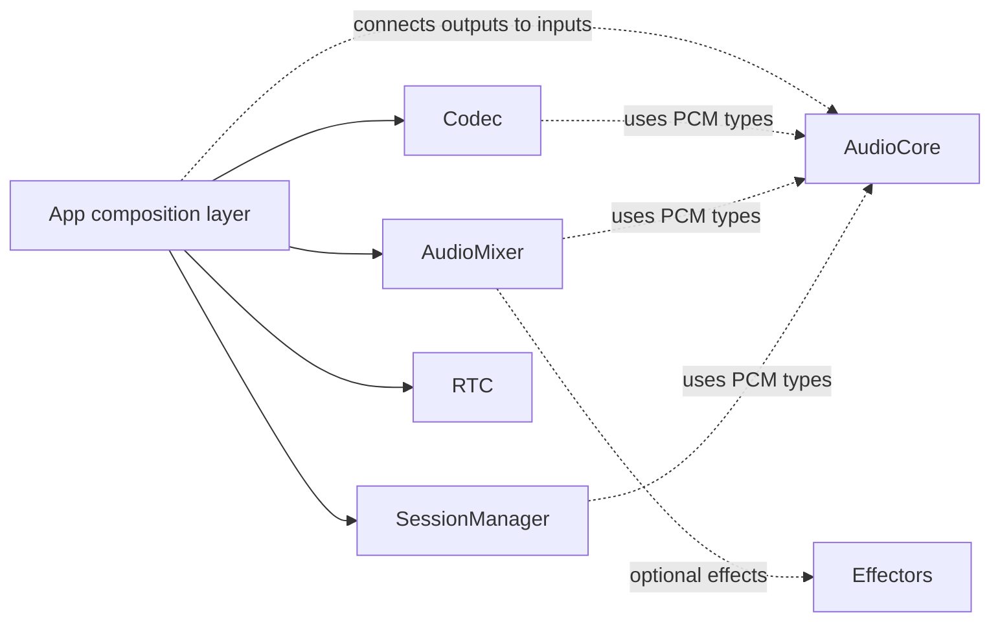
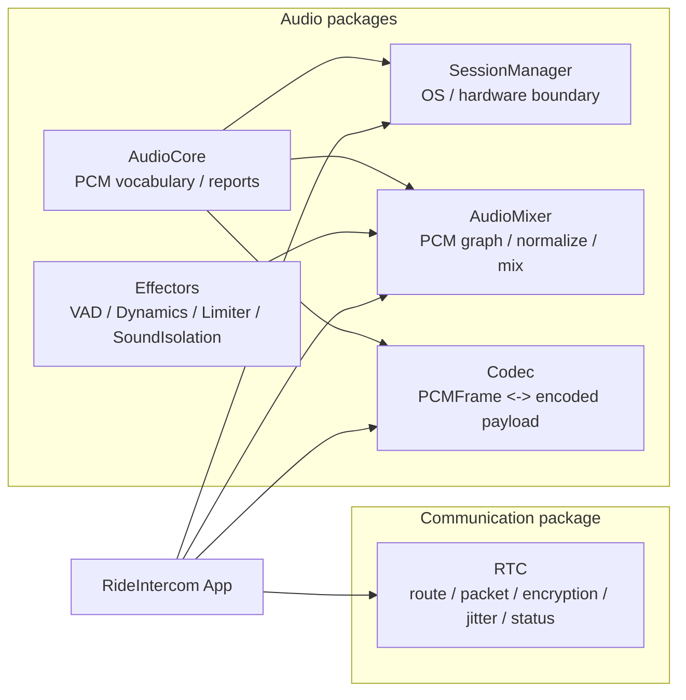

# Package 統合仕様

RideIntercom の package 群は、App の都合ではなく、音声、通信、OS差分、format差分をそれぞれの境界で吸収するための独立したライブラリとして設計する。

この文書は「全packageを同時に移植しなければならない」という仕様ではない。各packageは単独で移植できる。ここでは、複数packageを同じAppで使う場合の接続ルール、責務境界、エラー出力の扱いだけを定義する。

App は必要な package だけを組み合わせる。package 内の責務を App に移さない。App を作り直しても、各packageの外部仕様が変わらないことを優先する。

## 独立性の原則

| 原則 | 仕様 |
|---|---|
| 単独移植 | 各packageは、そのpackageの `Package.swift` が宣言する依存だけで別Appへ移植できる |
| 統合任意 | この文書の end-to-end flow は RideIntercom での組み合わせ例であり、全Appへの必須構成ではない |
| 上位composition | package同士を直接循環依存させず、Appまたは上位層が接続する |
| 共通語彙 | Audio系package間でPCMを渡す場合だけ `AudioCore` を共有語彙として使う |
| 通信独立 | `RTC` は Audio package に依存せず、他Appでは通信package単体として使える |

## 移植単位

| 移植したい機能 | 移植するpackage | 追加で必要なpackage | 不要なpackage |
|---|---|---|---|
| PCM型、signal meter、report型だけ使う | `AudioCore` | なし | `SessionManager`, `AudioMixer`, `Codec`, `RTC` |
| OS audio session / hardware I/Oだけ使う | `SessionManager` | `AudioCore` | `AudioMixer`, `Codec`, `RTC` |
| PCM graph / mix / effect chainだけ使う | `AudioMixer` | `AudioCore`、必要なEffectors | `SessionManager`, `Codec`, `RTC` |
| codec encode / decodeだけ使う | `Codec` | `AudioCore` | `SessionManager`, `AudioMixer`, `RTC` |
| VAD / Dynamics / Limiter / SoundIsolationだけ使う | 対象Effector | packageごとの依存だけ | `AudioMixer`, `SessionManager`, `Codec`, `RTC` |
| route / packet / encryption / handoverだけ使う | `RTC` | なし | Audio packages |

## 統合時だけの関係

点線は package 依存、実線は App が使う入口を表す。`RTC` は Audio系packageへ点線を持たない。

## 全体構成

この図は RideIntercom で全packageを使う場合の全体像である。各packageの移植条件は「移植単位」の表を優先する。

## Package 境界

| package | 依存 | 持つ責務 | 持たない責務 |
|---|---|---|---|
| `AudioCore` | なし | PCM共通語彙、validation、signal measurement、report型 | resample、channel mix、volume、hardware、codec、transport |
| `SessionManager` | `AudioCore` | Audio Session、device、route、hardware capture/render、OS voice processing | PCM正規化、mix、effect、codec、RTC |
| `AudioMixer` | `AudioCore`、Effectors | PCM source/sink、bus graph、source ingress正規化、sink egress正規化、effect chain、volume、mix | hardware、codec、packet、暗号化 |
| `Codec` | `AudioCore` | `PCMFrame <-> EncodedCodecFrame`、codec availability、bit rate option、fallback report | PCM正規化、mix、packet、暗号化、jitter |
| Effectors | 必要に応じて `AudioCore` | 単機能effect、effect runtime snapshot | graph構築、hardware、codec、transport |
| `RTC` | なし | route、handover、packet envelope、encryption、jitter、metadata、runtime status | Audio package依存、DSP、codec encode/decode |

## End-to-End Flow

```mermaid
flowchart TB
    subgraph Send[Capture Send]
        HWIn[Input hardware]
        SessionIn[SessionManager<br/>actual hardware PCM]
        CaptureSource[MixerPCMSource<br/>source original format]
        CaptureBus[AudioMixer capture bus<br/>bus processing format]
        SendSink[MixerPCMSink<br/>codec target format]
        Encoder[CodecEncoder]
        SendPacket[RTCAudioPacket]
        RTCSend[RTC route send]

        HWIn --> SessionIn --> CaptureSource --> CaptureBus --> SendSink --> Encoder --> SendPacket --> RTCSend
    end

    subgraph Receive[Receive Output]
        RTCRecv[RTC route receive]
        RecvPacket[ReceivedAudioPacket]
        Decoder[CodecDecoder]
        PeerSource[MixerPCMSource<br/>peer original format]
        PeerBus[AudioMixer peer/master bus<br/>bus processing format]
        OutputSink[MixerPCMSink<br/>output hardware format]
        SessionOut[SessionManager output renderer]
        HWOut[Output hardware]

        RTCRecv --> RecvPacket --> Decoder --> PeerSource --> PeerBus --> OutputSink --> SessionOut --> HWOut
    end
```

この flow は RideIntercom の通話実装で採用する接続例である。別Appで `Codec` だけ、`RTC` だけ、`AudioMixer` だけを使う場合、この flow 全体を再現する必要はない。

## I/O とエラー出力の原則

| 原則 | 仕様 |
|---|---|
| エラーも外部出力 | throw、operation report、runtime event、snapshot failure、drop metrics はすべて package の外部出力として扱う |
| 継続可能な差分 | OS非対応、device不在、format mismatch、packet drop は可能な限り report / event / metrics に正規化する |
| Appで推測しない | App は package 内部状態を推測せず、snapshot、runtime report、event、metrics を表示や判断に使う |
| 音を変える場所を限定 | PCMのformat正規化、volume、effect、mixは `AudioMixer` に置く |
| 通信は音を変えない | `RTC` は codec metadata と payload を運ぶだけで、PCMやpayloadをDSPしない |
| hardware formatを偽装しない | `SessionManager` は actual hardware format をそのまま外へ出す |

## 変更判断表

| 変更したいこと | 変更するpackage | 変更してはいけないpackage |
|---|---|---|
| PCM型、frame validation、meter | `AudioCore` | `SessionManager`, `Codec`, `RTC` |
| マイク入力、出力renderer、OS route | `SessionManager` | `AudioMixer`, `RTC` |
| sample rate / channel count の吸収 | `AudioMixer` | `AudioCore`, `SessionManager`, `Codec`, `RTC` |
| peer volume、bus volume、master limiter | `AudioMixer` / Effectors | `RTC`, `Codec`, `SessionManager` |
| codec追加、bit rate fallback | `Codec` | `RTC`, `AudioMixer` |
| packet暗号化、重複排除、handover | `RTC` | `AudioMixer`, `Codec`, `SessionManager` |
| WebRTC SDK差分 | `RTCNativeWebRTC` | App, Audio packages |

## App Composition

| Appが扱うもの | Appが扱わないもの |
|---|---|
| packageの生成と接続 | package内部のOS分岐 |
| start/stop lifecycle | package内部のformat変換実装 |
| mute設定やpeer volume設定の入力 | RTC内でのDSP |
| package reports のDiagnostics表示 | hardware formatの偽装 |
| user settings からpackage設定への変換 | codec payload の中身解釈 |

`MediaPipeline` package は作らない。composition は App が行うが、glue code で package責務を肩代わりしない。
