# RTC パッケージ仕様

`RTC` は通信 package である。音声信号の内容は変更しない。`RTC` が扱う音声は、通信で必要な codec、format、sequence、timestamp、bit rate、payload などの metadata と opaque payload だけである。

## 最初に読む結論

| 観点 | 仕様 |
|---|---|
| packageの役務 | 接続、route選択、handover、packet envelope、暗号化、jitter/lifetime、application data、runtime status |
| packageの非役務 | resample、channel mix、gain、volume、limiter、VAD、noise reduction、encode/decode、transcoding、bit rate fallback |
| Multipeer | 近距離端末をApple `MultipeerConnectivity`で探し、App管理の encrypted packet audio を送受信するroute |
| WebRTC | internet越しのWebRTC接続を扱い、native WebRTC engineがmedia streamを所有するroute |
| Appの責務 | `SessionManager`、`AudioMixer`、`Codec`、`RTC` を接続し、routeごとのmedia ownershipに従う |
| 旧App互換 | 旧RTC audio API、thin wrapper、typealias互換層は作らない。Appはpackage APIへ移行する |

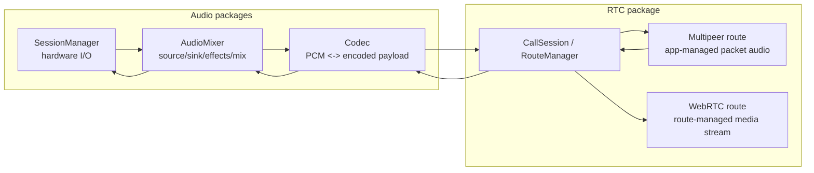

## 背景

| 問題 | RTCの解決 | RTC以外の解決 |
|---|---|---|
| 近くの端末とinternetなしで接続したい | `MultipeerLocalRoute` がlocal discoveryと`MCSession`を使う | AppはLocal Network/Bonjour権限を用意する |
| internet越しに接続したい | `WebRTCInternetRoute` がsignaling、SDP、ICE、native WebRTC engineをつなぐ | App/backendはCloudflare Realtime設定とproduction signalingを用意する |
| routeが変わってもApp側の呼び出しを変えたくない | `CallSession` がroute実装を隠し、`CallSessionEvent`で状態を出す | Appはeventを必ず購読してUIと診断へ反映する |
| sample rate、channel、bit rateが混在する | RTCはmetadataを保持し、format差だけではdropしない | `AudioMixer`がPCM source/sinkで正規化し、`Codec`がpayloadをdecodeする |
| Appをpackage化したら接続できない | 仕様上の境界をevent、route capability、media ownershipで明示する | Appは旧RTC audio APIを捨て、package接続を作り直す |

## Package Profile

| 項目 | 仕様 |
|---|---|
| パス | `RideIntercom/packages/RTC` |
| Products | `RTC`, `RTCNativeWebRTC` |
| `RTC` target依存 | 外部package依存なし |
| `RTCNativeWebRTC` target依存 | `RTC`, local binary target `WebRTC` |
| 近距離route | `MultipeerConnectivity` |
| 広域route | native WebRTC SDK、Cloudflare Realtime SFU/TURN前提 |
| 対応プラットフォーム | iOS `26.4`以降、macOS `26.4`以降 |
| Swift | Swift `6` |
| テスト | `RTC` targetはSDK非依存でSwiftPMテスト可能に保つ |

## 外部仕様参照

| 領域 | 参照 | RTCでの扱い |
|---|---|---|
| Multipeer Connectivity | https://developer.apple.com/documentation/multipeerconnectivity | nearby discovery、advertise/browse、`MCSession`、reliable/unreliable data送信の土台 |
| `MCNearbyServiceBrowser` | https://developer.apple.com/documentation/MultipeerConnectivity/MCNearbyServiceBrowser | service type `ride-intercom` のpeer探索とinvite |
| `MCNearbyServiceAdvertiser` | https://developer.apple.com/documentation/MultipeerConnectivity/MCNearbyServiceAdvertiser | service type `ride-intercom` のadvertiseとinvitation受理 |
| `MCSession` | https://developer.apple.com/documentation/multipeerconnectivity/mcsession | peer connection、暗号化必須session、data送受信 |
| WebRTC peer connection | https://webrtc.org/getting-started/peer-connections | SDP offer/answer、ICE candidate、STUN/TURN、connection stateの考え方 |
| WebRTC data channel | https://webrtc.org/getting-started/data-channels | `ApplicationDataMessage`のWebRTC DataChannel搬送 |
| Cloudflare Realtime | https://developers.cloudflare.com/realtime/ | SFU/TURNを使ったinternet routeのbackend前提 |
| Cloudflare TURN | https://developers.cloudflare.com/realtime/turn/ | NAT/firewall越えのrelay候補 |

## Package Structure

| パス | 役割 | 代表型 |
|---|---|---|
| `Sources/RTC/Core` | App向け共通contract | `CallSession`, `CallStartRequest`, `RTCAudioPacket`, `CallSessionEvent` |
| `Sources/RTC/Routing` | route plugin境界、factory、自動切替 | `RTCCallRoute`, `RouteManager`, `CallSessionFactory` |
| `Sources/RTC/PacketAudio` | packet envelope、暗号化、重複排除、期限管理 | `PacketAudioSequencer`, `PacketAudioReceiveFilter`, `PacketCrypto` |
| `Sources/RTC/Multipeer` | 近距離route実装 | `MultipeerLocalRoute`, `MultipeerPacketMediaSession` |
| `Sources/RTC/WebRTC` | WebRTC route contract、Cloudflare設定、signaling境界 | `WebRTCInternetRoute`, `NativeWebRTCEngine`, `WebRTCSignalingClient` |
| `Sources/RTCNativeWebRTC` | native WebRTC adapter | `WebRTCNativeEngine` |

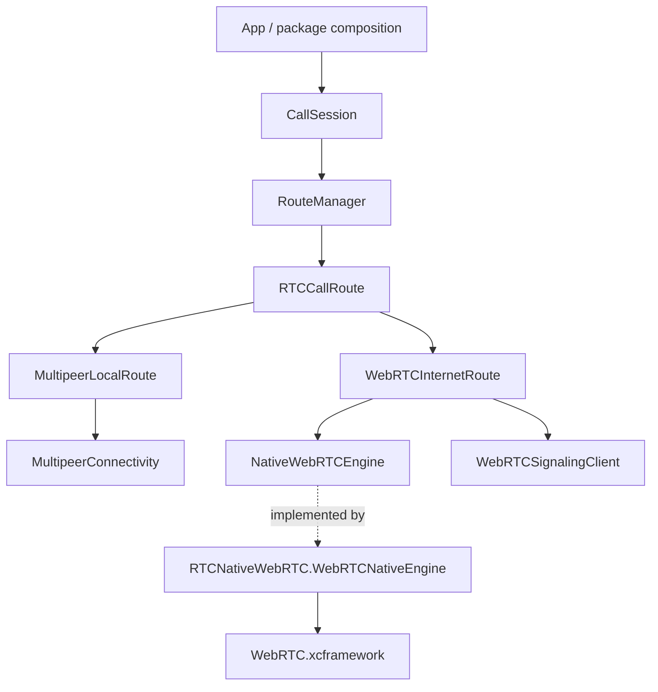

## Route比較

| 観点 | Multipeer | WebRTC |
|---|---|---|
| `RouteKind` | `.multipeer` | `.webRTC` |
| 想定範囲 | 近くの端末、同一空間、internetなしでも可 | internet越し、NAT/firewall越え、遠隔参加 |
| 外部基盤 | Apple `MultipeerConnectivity` | Cloudflare Realtime + native WebRTC SDK |
| discovery | `MCNearbyServiceBrowser` / `MCNearbyServiceAdvertiser` | Cloudflare room / participant signaling |
| connection | `MCSession` | `RTCPeerConnection` |
| signaling | 不要 | 必須。SDP offer/answerとICE candidateを交換する |
| app data | `MCSession.send` | DataChannel優先、失敗時signaling fallback |
| audio media | App管理の`RTCAudioPacket` | WebRTC engine管理のmedia stream |
| `supportsAppManagedPacketAudio` | `true` | `false` |
| `supportsRouteManagedMedia` | `false` | `true` |
| `mediaOwnership` | `.appManagedPacketAudio` | `.routeManagedMediaStream` |
| `sendAudioPacket` | 送信する | no-op |
| `receivedAudioPacket` | 受信eventを出す | 出さない |
| local mute | 現状route内no-op | local audio trackを無効化する |
| output mute | 現状routeへ転送されるが、route実装次第 | native engineへ転送する |
| codec negotiation | App/Codecが決めたpayloadをmetadata付きで流す | native WebRTC側に閉じる |
| DSP | 禁止 | 禁止 |
| 典型的な接続不能原因 | Local Network/Bonjour未設定、groupHash不一致、`startMedia`未呼び出し | signaling未注入、WebRTC binary unavailable、Cloudflare設定なし |

## Route選択

| 設定 | 意味 | 実装上の結果 |
|---|---|---|
| `enabledRoutes` | 利用可能にするroute集合 | `CallSessionFactory`が構築対象を絞る |
| `preferredRoute` | 最初にactiveにするroute | `RouteManager.startConnection()`が最初に接続する |
| `.singleRoute` | fallbackしない | active route失敗で`failed`へ進む |
| `.automaticFallback` | preferred失敗時にfallbackする | 復帰してもpreferredへ戻さない |
| `.automaticFallbackAndRestore` | fallback後、preferred復帰時に戻す | `restoreProbeDuration`後にhandoverする |
| `fallbackDelay` | preferred routeを待つ時間 | 超過後にfallback候補を起動する |
| `handoverFadeDuration` | media route切替時の旧route停止遅延 | media開始済みの場合だけ使う |
| `keepsPreferredRouteInStandby` | preferred以外も先に接続開始する | fallbackを速くするが通信資源を使う |
| `keepsFallbackRouteWarm` | fallback後も旧route接続を残す | 復帰や再fallbackを速くする |

## Route Opt-out

| 設定 | 仕様 | 外部から見える結果 |
|---|---|---|
| `enabledRoutes`から`.multipeer`を外す | `CallSessionFactory`は`MultipeerLocalRoute`を構築しない | advertise/browseしない。Multipeerへのfallbackもしない |
| `enabledRoutes`から`.webRTC`を外す | `CallSessionFactory`は`WebRTCInternetRoute`を構築しない | signaling接続しない。WebRTC binaryやCloudflare設定を要求しない |
| `enabledRoutes`が空 | 構築可能routeがない | `CallSessionEvent.error(.noEnabledRoute)`と`stateChanged(.failed)`を出す |
| `preferredRoute`が`enabledRoutes`にない | `CallRouteConfiguration.normalized()`が有効routeの先頭へ補正する | 補正後routeがactive候補になる |
| opt-out済みroute | route setに存在しない | `routeAvailabilityChanged`も`metricsChanged`も出さない |
| 通話中のroute enable/disable | `CallSession`の差分更新APIでは扱わない | Appはmedia/connectionを停止し、新しいconfigurationでsessionを作り直す |

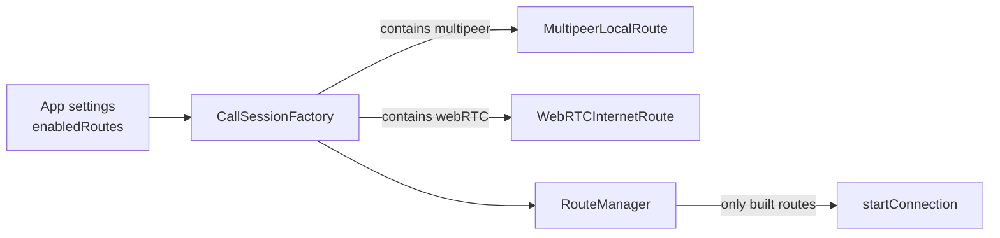

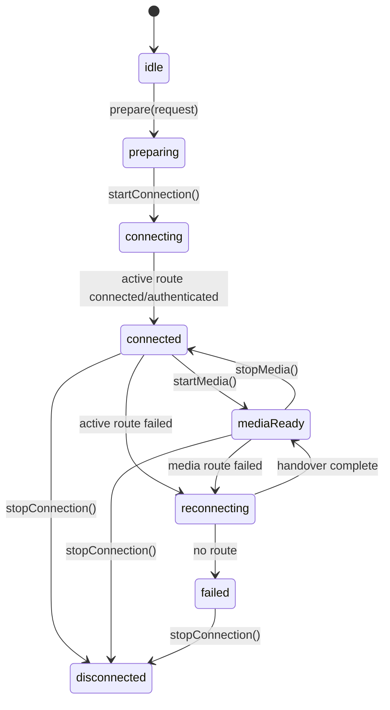

## Audio Boundary

| 持つ | 持たない |
|---|---|
| route selection / handover | Audio package dependency |
| connection lifecycle | resample / channel mix |
| packet envelope | gain / volume |
| encryption | limiter / dynamics |
| duplicate / lifetime / jitter handling | VAD / noise reduction |
| audio metadata transport | codec encode / decode / transcoding |
| runtime status | bit rate adjustment |

RTC targetは`SessionManager`、`AudioMixer`、`Codec`、Effectorsをimportしない。

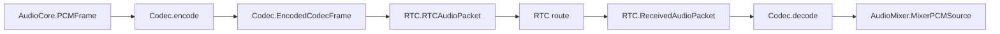

## Audio Contract

| 型 | 契約 |
|---|---|
| `RTCAudioCodecIdentifier` | 通信metadata用のcodec identifier。Codec packageの型ではない |
| `RTCAudioFormat` | packet metadata用のsample rate / channel count。AudioCoreの処理formatではない |
| `RTCAudioPolicy` | route上の希望codec、希望送信format、maximum bit rateを持つ |
| `RTCAudioPacket` | codec、format、sequence、timestamp、sample count、bit rate、opaque payloadを持つ |
| `ReceivedAudioPacket` | peerIDと`RTCAudioPacket`を束ねる |

| 変換 | 所有package | RTCでの扱い |
|---|---|---|
| `PCMFrame -> EncodedCodecFrame` | `Codec` | 関与しない |
| `EncodedCodecFrame -> RTCAudioPacket` | App composition | metadataを詰め替える |
| `RTCAudioPacket -> EncodedCodecFrame` | App composition | metadataを詰め替える |
| `EncodedCodecFrame -> PCMFrame` | `Codec` | 関与しない |
| mixed sample rate / channel | `AudioMixer` | format差だけではdropしない |
| bit rate fallback | `Codec` | `bitRate` metadataを保持するだけ |

`RTCAudioPolicy.preferredSendFormat`は通信上の希望であり、playback format、mixer format、hardware formatを固定しない。

## DSP禁止

| 禁止 | 所有package |
|---|---|
| sample rate変換 | `AudioMixer` |
| channel count変換 | `AudioMixer` |
| gain / volume | `AudioMixer` |
| limiter / dynamics / VAD gate | Effectors in `AudioMixer` graph |
| OS voice processing / input mute | `SessionManager` |
| encode / decode / transcoding | `Codec` |
| codec bit rate fallback | `Codec` |

RTC route、packet filter、jitter buffer、WebRTC adapterのどこにもDSPを入れない。

## Receive Policy

| 条件 | 扱い | 理由 |
|---|---|---|
| sample rateがpacketごとに違う | dropしない | 受信sourceの正規化は`AudioMixer`の責務 |
| channel countがpacketごとに違う | dropしない | 受信sourceの正規化は`AudioMixer`の責務 |
| bit rateがpacketごとに違う | dropしない | codec runtime差分として扱う |
| codecがpacketごとに違う | policyで許可されていればdropしない | payload decode可否は`Codec`で判断する |
| unsupported codec | drop / error | route policy外のpayloadはdecodeできない |
| duplicate sequence | drop | 同一peer/sequenceの二重再生を防ぐ |
| expired packet | drop | 遅延しすぎた音声を再生しない |
| decrypt failure | drop | credential不一致または改ざんの疑い |

decode failureは`Codec`の失敗として扱う。RTCはcodec payloadを解釈しない。

## Multipeerの背景

| Apple概念 | RTCでの実装 | 利用者が知るべきこと |
|---|---|---|
| `MCPeerID` | `localDisplayName`から生成 | peerの表示名兼近距離識別子になる |
| `MCNearbyServiceAdvertiser` | `serviceType = ride-intercom`でadvertise | iOS/macOSのLocal Network/Bonjour設定が必要 |
| `MCNearbyServiceBrowser` | 同じ`serviceType`をbrowse | 見つけたpeerへ自動inviteする |
| `discoveryInfo` | `groupHash`を小さなTXT情報として渡す | group不一致のpeerを発見段階で避ける |
| invitation context | `groupHash`を渡す | invite受理前にgroup不一致を拒否する |
| `MCSession` | `encryptionPreference = .required` | transport自体も暗号化必須 |
| `MCSessionSendDataMode.reliable` | control、handshake、reliable app data | 順序と到達を優先する |
| `MCSessionSendDataMode.unreliable` | packet audio、keepalive、unreliable app data | 遅延の小ささを優先する |

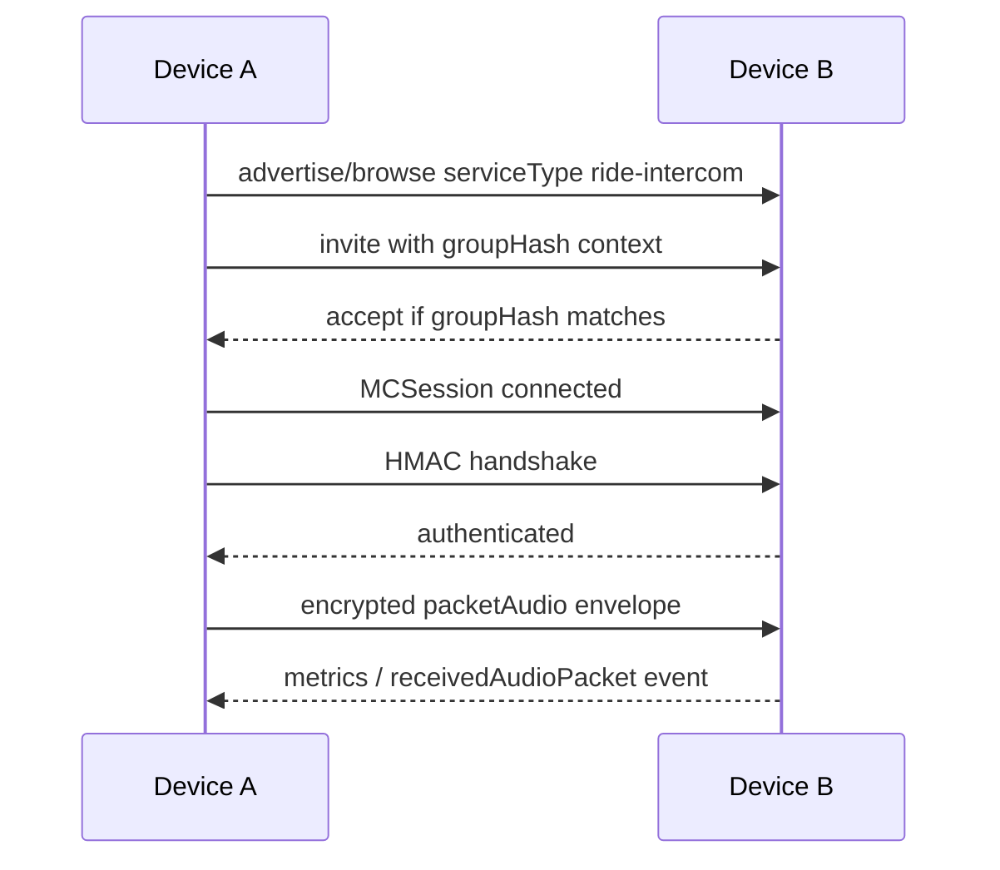

## Multipeer利用条件

| 条件 | 必須設定 | 接続不能時の見え方 |
|---|---|---|
| Local Network許可 | `NSLocalNetworkUsageDescription` | advertise/browse開始失敗、peerが見えない |
| Bonjour service宣言 | `NSBonjourServices`に`_ride-intercom._tcp` | iOSで探索できない |
| service type | `ride-intercom` | 違うservice typeのAppとは見つからない |
| group認証 | 同じ`groupID`とsecretから`RTCCredential.derived` | invite拒否、handshake rejected |
| packet audio開始 | `startMedia()`を呼ぶ | connectedでもaudio packetが送られない |
| codec policy | 送信packet codecが`preferredCodecs`に含まれる | unsupported codec error/drop |
| background復帰 | App側でconnection lifecycleを再開する | OSがadvertise/browseやsessionを止める場合がある |

## WebRTCの背景

| WebRTC概念 | RTCでの実装 | 利用者が知るべきこと |
|---|---|---|
| signaling | `WebRTCSignalingClient` | WebRTC仕様外なのでApp/backendが実装または注入する |
| SDP offer/answer | `WebRTCSessionDescription` | remote peerとmedia/data能力を交換する |
| ICE candidate | `WebRTCIceCandidate` | NAT/firewall越えの接続候補を交換する |
| STUN/TURN | `WebRTCIceServer` / Cloudflare TURN | 直接接続できない環境でrelay候補になる |
| peer connection | `NativeWebRTCEngine.createPeerConnection` | native WebRTC SDKが所有する |
| local audio track | `NativeWebRTCEngine.prepareLocalAudio` | `startMedia()`までdisabled |
| DataChannel | `NativeWebRTCEngine.sendApplicationData` | app dataの第一候補 |
| SFU | Cloudflare Realtime | 複数参加や広域routeの中継基盤 |

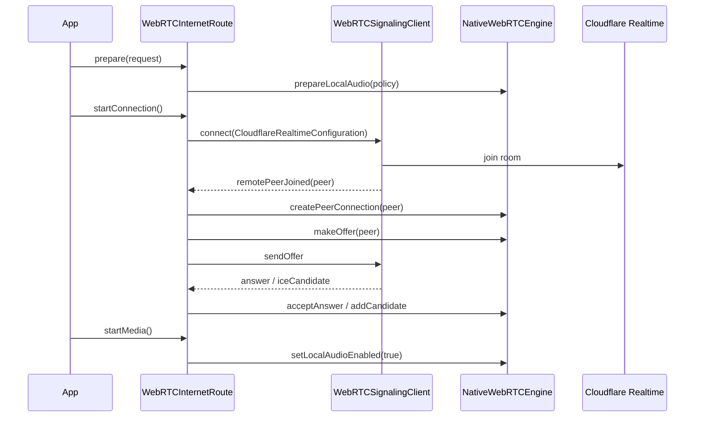

## WebRTC利用条件

| 条件 | 必須設定 | 接続不能時の見え方 |
|---|---|---|
| WebRTC binary | `RTCNativeWebRTC` productと`WebRTC.xcframework` | `Native WebRTC SDK is unavailable` |
| native engine | `engineFactory: { WebRTCNativeEngine(...) }` | base `NativeWebRTCEngine`は`isAvailable == false` |
| signaling | production `WebRTCSignalingClient` | default clientは意図的にfailure eventを出す |
| Cloudflare設定 | `CloudflareRealtimeConfiguration`をproviderで返す | `WebRTC route configuration is unavailable` |
| room/participant | `roomID`, `participantToken` | signaling接続失敗、remote peerが現れない |
| ICE server | 必要な`iceServers` / TURN設定 | peer connectionが`failed`または`disconnected` |
| media開始 | `startMedia()`を呼ぶ | local audio trackが有効化されない |
| app-managed packet audio | 使わない | `sendAudioPacket`はWebRTC routeでは送られない |

## 必要な設定

| 対象 | 要否 | 設定 | 設定する場所 | 欠けた場合 |
|---|---|---|---|---|
| 共通 | 必須 | `sessionID` | `CallStartRequest.sessionID` | packet envelope、runtime status、room紐付けが成立しない |
| 共通 | 必須 | `localPeer` | `CallStartRequest.localPeer` | peer識別、handshake、member表示が成立しない |
| 共通 | 推奨 | `expectedPeers` | `CallStartRequest.expectedPeers` | member診断や期待参加者の表示精度が落ちる |
| 共通 | 必須、既定値可 | `configuration` | `CallStartRequest.configuration` | 明示しない場合はroute選択、fallback、handoverが既定値に従う |
| 共通 | 必須、既定値可 | `audioPolicy` | `CallStartRequest.audioPolicy` | 明示しない場合は`pcm16`、48kHz、monoの通信希望になる |
| Multipeer | 必須 | `localDisplayName` | `CallSessionFactoryConfiguration.localDisplayName` | `MCPeerID`の表示名が決まらずfactory設定が成立しない |
| Multipeer | 条件付き必須 | `RTCCredential` | `CallStartRequest.credential` | 未指定なら認証なし接続になる。group分離が必要な通話では必ず指定する |
| Multipeer | 必須 | `NSLocalNetworkUsageDescription` | App `Info.plist` | local network許可が出ずpeer探索できない |
| Multipeer | 必須 | `NSBonjourServices` | App `Info.plist` | Bonjour service `ride-intercom`を探索できない |
| WebRTC | 必須 | `CloudflareRealtimeConfiguration` | `WebRTCRouteFactoryConfiguration.cloudflareConfigurationProvider` | `WebRTC route configuration is unavailable` |
| WebRTC | 必須 | production signaling | `WebRTCRouteFactoryConfiguration.signalingClientFactory` | default signalingがfailure eventを出す |
| WebRTC | 必須 | native engine | `WebRTCRouteFactoryConfiguration.engineFactory` | base engineは`isAvailable == false` |
| WebRTC | 必須 | `RTCNativeWebRTC` product | App package dependency | native WebRTC routeが実体化しない |
| WebRTC | 必須 | `WebRTC.xcframework` | `RTCNativeWebRTC` binary target | `Native WebRTC SDK is unavailable` |

## 必要なサーバー / Backend

| route | 必要なサーバー | RTC packageが持つもの | App/backendが持つもの |
|---|---|---|---|
| Multipeer | 不要 | local discovery、invite、`MCSession`接続、packet envelope、AES-GCM | Local Network/Bonjour権限、group secret管理、App lifecycle再接続 |
| WebRTC | 必須 | WebRTC route contract、Cloudflare設定型、signaling client protocol、native engine境界 | Cloudflare room作成、participant token発行、production signaling、TURN/ICE設定 |

| WebRTC backend要素 | 要否 | 必須情報 | 役割 |
|---|---|---|---|
| SFU endpoint | 必須 | `CloudflareRealtimeConfiguration.sfuEndpoint` | room参加とmedia/data中継の接続先 |
| TURN endpoint | 条件付き | `CloudflareRealtimeConfiguration.turnEndpoint` | NAT/firewallで直接接続できない場合のrelay候補 |
| room | 必須 | `roomID` | 通話sessionとCloudflare側roomを結びつける |
| participant credential | 必須 | `participantToken` | Cloudflare側participant権限 |
| ICE servers | 条件付き、推奨 | `iceServers` | `RTCPeerConnection`へ渡すSTUN/TURN候補 |
| signaling transport | 必須 | `WebRTCSignalingClient`実装 | join、presence、offer、answer、ICE candidate、app data fallbackを運ぶ |

`CloudflareRealtimeSignalingClient`はproduction server clientではない。実運用では、App/backendが上表のsignaling transportを実装して注入する。

## Control Plane / Media Plane

| 種別 | Multipeer | WebRTC |
|---|---|---|
| discovery | Bonjour service `ride-intercom` | Cloudflare room / participant |
| auth | group hash と HMAC handshake | Cloudflare participant token と app-level credential |
| route control | `MultipeerWireMessage.control` | signaling またはDataChannel |
| app data | `MultipeerWireMessage.applicationData` | DataChannel、失敗時はsignaling fallback |
| audio media | encrypted packet audio | native WebRTC media stream |
| codec payload | opaque `RTCAudioPacket.payload` | native WebRTC codec selection |
| error output | `CallSessionEvent.error`, `RouteAvailability.reason`, metrics | `CallSessionEvent.error`, `RouteAvailability.reason`, route state |

## Public Contract

| 型 | 契約 |
|---|---|
| `CallSession` | prepare、connection、media、packet audio、application data、runtime reportを扱うfacade |
| `CallStartRequest` | peer、credential、route configuration、audio policyを渡す |
| `CallRouteConfiguration` | enabled route、preferred route、fallback / restore policyを持つ |
| `CallSessionEvent` | state、route、member、metrics、application data、audio packet、errorを通知する |
| `RTCCallRoute` | route plugin境界。Appは直接保持しない |
| `RouteManager` | route set、active route、media route、handover、runtime statusを管理する |
| `PacketAudioSequencer` | `RTCAudioPacket`をsession / sender metadata付きenvelopeにする |
| `PacketAudioReceiveFilter` | codec policy、duplicate、lifetime、decrypt結果を検証する |
| `RTCRuntimeStatus` | connection、route、media、audio policy、package reportsを診断用に保持する |

## Input / Output

| 外部入力 | 正常出力 | エラー出力 | 保証 |
|---|---|---|---|
| `CallStartRequest` | route prepare結果 / events | `CallSessionEvent.error` | peer、credential、route設定、audio policyを各routeへ渡す |
| `startConnection()` | connection events | failed / unavailable event | control planeを開始する |
| `startMedia()` | media route events | route error event | active routeのmedia ownershipに従って開始する |
| `sendAudioPacket(RTCAudioPacket)` | route payload | route未対応時は送らない | app-managed packet audio routeだけへ送る |
| route受信packet | `CallSessionEvent.receivedAudioPacket` | policy drop / decrypt failure / expired / duplicate metrics | metadataとopaque payloadを変更せず通知する |
| `sendApplicationData` | route payload | `unsupportedApplicationDataDelivery` | delivery modeをroute capabilityに照合する |
| `updateRuntimePackageReports` | runtime status payload | encode不可なら送らない | 他package reportを解釈せず同梱する |
| `setLocalMute` | routeへmute要求 | routeごとのunsupportedは状態/reportで見る | RTCはgain処理をしない |
| `setOutputMute` | routeへmute要求 | routeごとのunsupportedは状態/reportで見る | RTCはmix/output処理をしない |

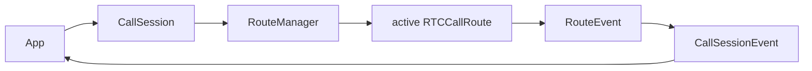

## 利用手順

| 手順 | Appが行うこと | 必須理由 |
|---|---|---|
| event購読 | `session.events`を先に購読する | 接続、認証、route失敗、受信packet、診断はeventで出る |
| factory設定 | `CallSessionFactoryConfiguration`を作る | route実装とWebRTC injectionを決める |
| request作成 | `CallStartRequest`を作る | session、peer、expected peers、credential、route、audio policyを固定する |
| prepare | `await session.prepare(request)` | 各routeが利用可能性、codec policy、engine availabilityを確認する |
| connection開始 | `await session.startConnection()` | discovery/signaling/control planeを開始する |
| connected判定 | `stateChanged`, `membersChanged`, `routeChanged`を見る | Appが勝手に接続済みと見なさない |
| audio package開始 | `SessionManager`、`AudioMixer`、`Codec`を起動する | RTCは音声I/Oやencode/decodeをしない |
| media開始 | `await session.startMedia()` | Multipeer packet audioやWebRTC local trackを有効化する |
| packet送信 | Multipeer active時だけ`sendAudioPacket`する | WebRTCではpacket audioは送られない |
| packet受信 | `receivedAudioPacket`を`Codec -> AudioMixer -> SessionManager`へ渡す | RTCはdecode/mix/outputしない |
| runtime report | 他package reportを`updateRuntimePackageReports`で渡す | peerへ診断情報を届ける |
| 停止 | `stopMedia()`、`stopConnection()` | mediaとconnectionを別状態で閉じる |

## 利用例

### Multipeer packet audio

```swift
import Foundation
import RTC

let routeConfiguration = CallRouteConfiguration(
    enabledRoutes: [.multipeer],
    preferredRoute: .multipeer
)

let audioPolicy = RTCAudioPolicy(
    preferredSendFormat: RTCAudioFormat(sampleRate: 48_000, channelCount: 1),
    preferredCodecs: [.opus, .pcm16],
    maximumBitRate: 32_000
)

let session = CallSessionFactory.makeSession(
    CallSessionFactoryConfiguration(
        localDisplayName: localPeerID.rawValue,
        routeConfiguration: routeConfiguration,
        audioPolicy: audioPolicy
    )
)

Task {
    for await event in session.events {
        handleRTCEvent(event)
    }
}

let request = CallStartRequest(
    sessionID: groupID,
    localPeer: PeerDescriptor(id: localPeerID, displayName: displayName),
    expectedPeers: expectedPeers,
    credential: RTCCredential.derived(groupID: groupID, secret: groupSecret),
    configuration: routeConfiguration,
    audioPolicy: audioPolicy
)

await session.prepare(request)
await session.startConnection()
await session.startMedia()

let packet = RTCAudioPacket(
    sequenceNumber: sequenceNumber,
    codec: .opus,
    format: audioPolicy.preferredSendFormat,
    capturedAt: capturedAt,
    sampleCount: sampleCount,
    bitRate: 32_000,
    payload: encodedPayload
)
await session.sendAudioPacket(packet)
```

### WebRTC route-managed media

```swift
import Foundation
import RTC
import RTCNativeWebRTC

let routeConfiguration = CallRouteConfiguration(
    enabledRoutes: [.webRTC],
    preferredRoute: .webRTC
)

let audioPolicy = RTCAudioPolicy(preferredCodecs: [.routeManaged])

let webRTC = WebRTCRouteFactoryConfiguration(
    cloudflareConfigurationProvider: { request in
        CloudflareRealtimeConfiguration(
            sfuEndpoint: sfuEndpoint,
            turnEndpoint: turnEndpoint,
            roomID: request.sessionID,
            participantToken: participantToken,
            iceServers: iceServers
        )
    },
    signalingClientFactory: { ProductionWebRTCSignalingClient() },
    engineFactory: { WebRTCNativeEngine(iceServers: iceServers) }
)

let session = CallSessionFactory.makeSession(
    CallSessionFactoryConfiguration(
        localDisplayName: localPeerID.rawValue,
        routeConfiguration: routeConfiguration,
        audioPolicy: audioPolicy,
        webRTC: webRTC
    )
)

let request = CallStartRequest(
    sessionID: groupID,
    localPeer: PeerDescriptor(id: localPeerID, displayName: displayName),
    expectedPeers: expectedPeers,
    credential: RTCCredential.derived(groupID: groupID, secret: groupSecret),
    configuration: routeConfiguration,
    audioPolicy: audioPolicy
)

await session.prepare(request)
await session.startConnection()
await session.startMedia()
```

| 注意 | 理由 |
|---|---|
| `ProductionWebRTCSignalingClient`はApp/backend側で実装する | default `CloudflareRealtimeSignalingClient`は注入境界を示すplaceholderで、接続成功させない |
| WebRTCでは`sendAudioPacket`を呼んでも送られない | route capabilityが`supportsAppManagedPacketAudio == false` |
| WebRTCの受信音声は`receivedAudioPacket`として出ない | route-managed media streamとしてnative engineが所有する |

| 修正者向け注意 | 現実装 |
|---|---|
| `NativeWebRTCEngine` base class | `RTC` target単体では`isAvailable == false`。WebRTC接続には`RTCNativeWebRTC.WebRTCNativeEngine`か同等実装が必要 |
| `CloudflareRealtimeSignalingClient` | production transportではない。`connect`時にfailure eventを出す注入境界 |
| WebRTC DataChannel | 現実装は`rideintercom.application`のordered channelを作る。delivery品質を厳密に分ける場合はengine側でchannel設定を分ける |
| WebRTC output mute | `CallSession`からrouteへ要求は流れる。実際のmute可否はnative engine実装で保証する |

## App package化で接続不能になる典型原因

| 症状 | 仕様上の意味 | 修正方針 |
|---|---|---|
| `RTC.AudioFormatDescriptor`がない | PCM/format共通語彙はRTCから外した | 音声formatは`AudioCore.AudioFormat`、通信metadataは`RTCAudioFormat`へ分ける |
| `RTC.AudioFrame` / `RTC.ReceivedAudioFrame`がない | RTCはPCM frameを持たない | `AudioCore.PCMFrame`と`Codec.EncodedCodecFrame`をApp compositionで`RTCAudioPacket`へ詰め替える |
| `AudioFrameCodec` / `PCM16AudioCodec`がない | encode/decodeは`Codec` packageへ移した | RTCへcodec registryを渡さず、App側で`CodecEncoder` / `CodecDecoder`を使う |
| `packetAudioCodecRegistry`引数がない | RTCはcodec実装を保持しない | `CallSessionFactoryConfiguration.audioPolicy`だけを渡す |
| `startConnection`で失敗する | `prepare`未実行、route構築不可、preferred route不在 | eventの`connectionFailed`、`noEnabledRoute`、`routeAvailabilityChanged`を読む |
| Multipeerでpeerが見えない | advertise/browse前提が満たされていない | Local Network/Bonjour、service type、同一ネットワーク、groupHashを確認する |
| Multipeerでconnectedだが音声なし | media未開始またはpacket audio inactive | `startMedia()`後に`sendAudioPacket`し、`receivedAudioPacket`をCodec/Mixerへ流す |
| WebRTCで即failed | signalingまたはengineが未注入 | `WebRTCRouteFactoryConfiguration`にproduction signalingと`WebRTCNativeEngine`を渡す |
| WebRTCでpacket送信しても音声なし | WebRTCはroute-managed media | `sendAudioPacket`ではなくWebRTC engineのmedia lifecycleを使う |
| format違いで受信が止まると思っている | RTCはformat差でdropしない | `Codec` decode後、`AudioMixer.MixerPCMSource`へ入れて正規化する |
| route切替後にUIが古い | event購読漏れ | `stateChanged`, `routeChanged`, `membersChanged`, `metricsChanged`, `error`を状態源にする |
| remote診断が来ない | runtime report送信条件が満たされていない | active route、app data capability、`updateRuntimePackageReports`のpayload化を確認する |

## Multipeer Packet Flow

| flow | 経路 | RTCの責務 |
|---|---|---|
| capture send | `SessionManager input -> AudioMixer TX bus -> Codec -> RTCAudioPacket -> RTC` | envelope化、暗号化、unreliable送信 |
| receive output | `RTC -> ReceivedAudioPacket -> Codec -> AudioMixer RX bus -> SessionManager output` | 復号、重複排除、lifetime、playout delay、event出力 |
| app data | `ApplicationDataMessage -> MultipeerWireMessage.applicationData` | reliable/unreliableを`MCSessionSendDataMode`へ写す |
| control | `RouteHandshakeMessage -> MultipeerWireMessage.control` | groupHash/HMACで認証する |

```mermaid
flowchart LR
    Capture[SessionManager input\nactual PCM] --> TXSource[MixerPCMSource\ncapture]
    TXSource --> TXBus[AudioMixer TX bus\nnormalization/effects]
    TXBus --> SendSink[MixerPCMSink\nsend format]
    SendSink --> Encode[CodecEncoder]
    Encode --> Packet[RTCAudioPacket]
    Packet --> MC[MultipeerLocalRoute\nAES-GCM + MCSession]
    MC --> Received[ReceivedAudioPacket]
    Received --> Decode[CodecDecoder]
    Decode --> RXSource[MixerPCMSource\npeer]
    RXSource --> RXBus[AudioMixer RX/master bus]
    RXBus --> OutputSink[MixerPCMSink\nhardware output format]
    OutputSink --> Output[SessionManager output]
```

## WebRTC Media Flow

| flow | 経路 | RTCの責務 |
|---|---|---|
| connection | `CallSession -> WebRTCInternetRoute -> WebRTCSignalingClient -> Cloudflare` | signaling接続を開始する |
| peer setup | `remotePeerJoined -> NativeWebRTCEngine.createPeerConnection` | peer connection生成を指示する |
| offer/answer | `NativeWebRTCEngine <-> WebRTCSignalingClient` | SDPを運ぶ |
| ICE | `NativeWebRTCEngine <-> WebRTCSignalingClient` | candidateを運ぶ |
| media | `NativeWebRTCEngine local/remote audio track` | lifecycleを開始/停止する |
| app data | `DataChannel -> signaling fallback` | delivery差異を吸収する |

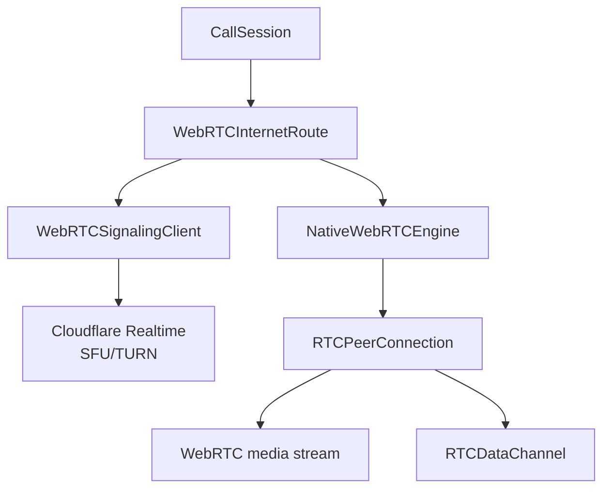

## Route Ownership

| route | media ownership | audio behavior | Appの扱い |
|---|---|---|---|
| Multipeer | `.appManagedPacketAudio` | encrypted packet audioを送受信する | Codec/Mixer/SessionManagerをApp compositionで接続する |
| WebRTC | `.routeManagedMediaStream` | native WebRTC media streamのlifecycleだけを扱う | packet audio pipelineへ流さない |

WebRTC active時にapp-managed packet audioを流さない。WebRTC codec negotiationはnative WebRTC側に閉じる。

## Handover

| 条件 | `.singleRoute` | `.automaticFallback` | `.automaticFallbackAndRestore` |
|---|---|---|---|
| preferred route接続失敗 | `failed`へ進む | fallback候補へ切り替える | fallback候補へ切り替える |
| active route切断 | `failed`へ進む | fallback候補へ切り替える | fallback候補へ切り替える |
| fallback後にpreferred復帰 | 戻らない | 戻らない | `restoreProbeDuration`後にpreferredへ戻す |
| opt-out済みroute | 候補にしない | 候補にしない | 候補にしない |
| fallback候補なし | `failed`へ進む | `error(.noEnabledRoute)`または`failed` | `error(.noEnabledRoute)`または`failed` |

| media状態 | handover動作 | 外部出力 |
|---|---|---|
| media未開始 | 新routeのconnectionだけを開始する | `routeChanged(isHandoverInProgress: true/false)` |
| media開始済み | 新routeで`startMedia()`し、`handoverFadeDuration`後に旧routeのmediaを止める | `routeChanged`, `stateChanged(.mediaReady)` |
| `keepsFallbackRouteWarm == true` | 旧route connectionを残せる | runtime statusでactive/media route差分を見る |
| `keepsFallbackRouteWarm == false` | handover後に旧route connectionを止める | `routeChanged` |
| `keepsPreferredRouteInStandby == true` | preferred以外もstandby接続できる | fallbackまでの待ち時間を短くできる |

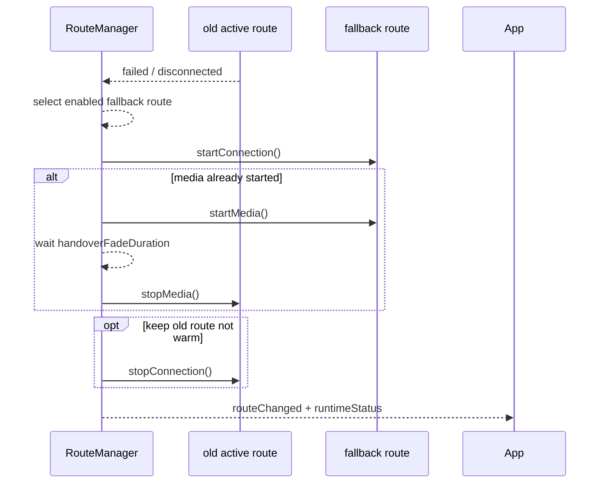

## Runtime Status

| 項目 | 仕様 |
|---|---|
| namespace | `rideintercom.rtc.runtimeStatus` |
| delivery | unreliableが使えるrouteではunreliable、使えない場合はreliable |
| trigger | connection、route、media、local mute、output mute、package report、periodic |
| payload | session、peers、connection state、active/media route、route capabilities、audio policy、package reports |
| package report | RTCはpayloadを解釈せず、package名、kind、contentType、payloadを保持する |

RTC statusは通信状態だけを確定情報として持つ。Mixer volume、Codec fallback、hardware formatは各packageのreportとして同梱する。

## Error I/O

| エラー出力 | 発生条件 | 外部から見える場所 | 利用者が取る行動 |
|---|---|---|---|
| `noEnabledRoute` | enabled routeが空、または構築可能routeがない | `CallSessionEvent.error` | route設定とplatform import可否を確認する |
| `routeUnavailable` | preferred routeが使えない | `CallSessionEvent.error` | preferredをenabled routeへ含めるかfallbackを有効にする |
| `signalingUnavailable` | WebRTC signaling設定がない | `CallSessionEvent.error`, `RouteAvailability` | production `WebRTCSignalingClient`とCloudflare設定を渡す |
| `connectionFailed` | route接続が失敗した | `CallSessionEvent.error`, `stateChanged(.failed)` | error message、OS権限、backend状態を見る |
| `unsupportedApplicationDataDelivery` | route capabilityとdelivery modeが一致しない | `CallSessionEvent.error` | reliable/unreliable指定をroute capabilityへ合わせる |
| `unsupportedAudioCodec` | packet codecがroute policyにない | route error、packet drop | `RTCAudioPolicy.preferredCodecs`とCodec設定を合わせる |
| duplicate packet | 同一peer/sequenceを受信した | drop metrics | 送信sequence管理を確認する |
| expired packet | packet lifetimeを超えた | drop metrics | network delay、packet lifetime、playout delayを確認する |
| decrypt failure | AES-GCM復号に失敗した | drop / route error | credentialのgroupID/secret不一致を確認する |
| `Native WebRTC SDK is unavailable` | base engineまたはbinary import不可 | `RouteAvailability.reason` | `RTCNativeWebRTC` productと`WebRTC.xcframework`を確認する |
| `WebRTC route configuration is unavailable` | providerが`nil`を返した | `RouteAvailability.reason` | `CloudflareRealtimeConfiguration`を返す |

エラーはI/Oである。RTCではthrowだけでなく、`CallSessionEvent.error`、`RouteAvailability.reason`、`RouteMetrics.droppedAudioFrameCount`、runtime statusを外部出力として扱う。

## Diagnostics Matrix

| 観点 | 見るevent/report | 読み方 |
|---|---|---|
| lifecycle | `stateChanged` | `preparing -> connecting -> connected -> mediaReady`へ進むか |
| active route | `routeChanged.activeRoute` | control/app dataを送るroute |
| media route | `routeChanged.mediaRoute` | mediaを持つroute |
| availability | `routeAvailabilityChanged` | OS/backend/credential前提の失敗理由 |
| member | `membersChanged` | 認証済みpeerの集合 |
| packet receive | `receivedAudioPacket` | Multipeer packet audioだけで出る |
| app data | `receivedApplicationData` | runtime statusやmute stateもここに入る |
| packet quality | `metricsChanged` | received/drop/queued、playout delay、active peer count |
| package reports | `RTCRuntimeStatus.packageReports` | Audio/Codec/Mixer/SessionManagerの状態はここで読む |

## WebRTC Binary

| 項目 | 方針 |
|---|---|
| source | `https://webrtc.googlesource.com/src` |
| repo管理 | Chromium / WebRTC source treeはrepositoryに含めない |
| artifact | 検証済み`WebRTC.xcframework`をbinary targetに渡す |
| build wrapper | `scripts/build-webrtc-xcframework.sh` |
| stable build | `scripts/build-current-webrtc-xcframework.sh` |
| header検証 | `scripts/verify-webrtc-xcframework.sh` |
| cleanup | `scripts/clean-webrtc-build-resources.sh`。削除時はdry-run解除を明示する |

| platform | build target | framework構造 | 差分の扱い |
|---|---|---|---|
| iOS device | `framework_objc`, `target_environment="device"` | `WebRTC.framework/Headers` | arm64 slice |
| iOS simulator | `framework_objc`, `target_environment="simulator"` | `WebRTC.framework/Headers` | x86_64 / arm64を統合 |
| macOS | `mac_framework_objc`, `target_os="mac"` | `WebRTC.framework/Versions/A/Headers` | x86_64 / arm64を統合 |

## Test Matrix

| 観点 | 確認 |
|---|---|
| metadata | codec、format、bit rate、payloadをenvelope後も保持する |
| mixed format receive | sample rate / channel count / bit rateの違いでdropしない |
| drop policy | unsupported codec、duplicate、expired、decrypt failureをdropする |
| DSP absence | RTC targetがAudio packageとDSP型に依存しない |
| Multipeer route | advertise/browse、groupHash filter、HMAC handshake、AES-GCM packet audioを確認する |
| WebRTC route | signaling injection、SDP/ICE relay、route-managed media、DataChannel fallbackを確認する |
| route-managed media | WebRTCがapp-managed packet audioを使わない |
| runtime status | route状態、audio policy、package reportを送信できる |
| App migration | 旧RTC audio APIなしで、AudioCore/Codec/AudioMixer/RTCをcompositionできる |
