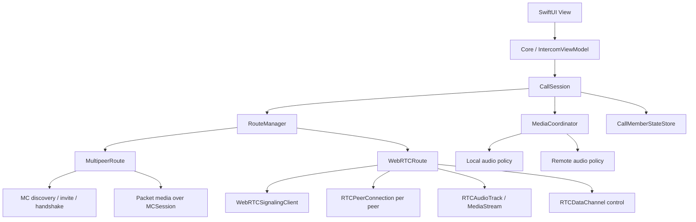
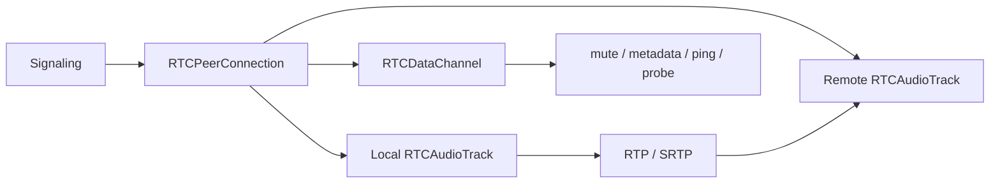
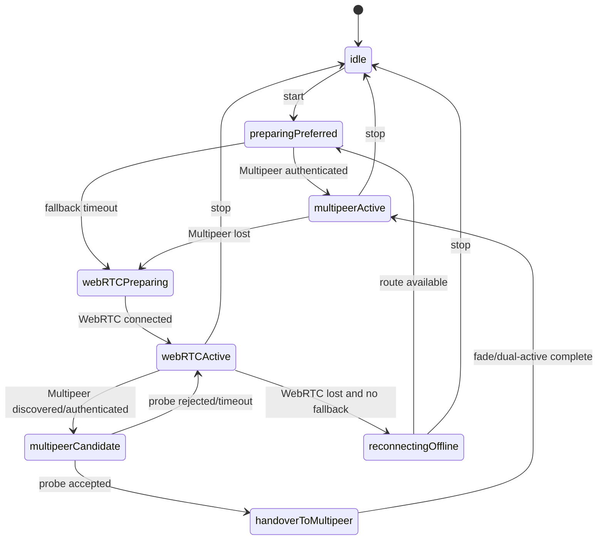
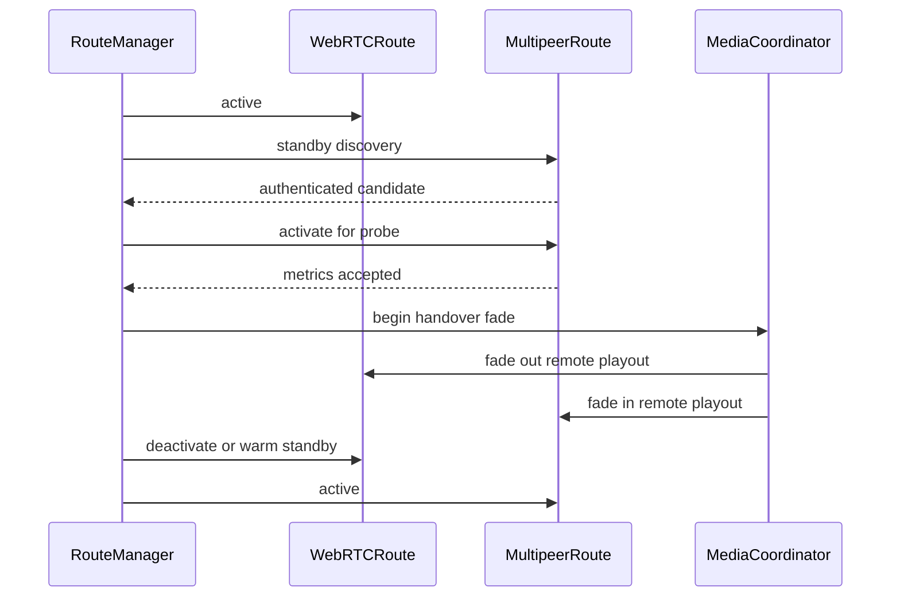

# RideIntercom アーキテクチャ設計

## 目的

本書は、RideIntercom の通話基盤を `MultipeerConnectivity` と WebRTC MediaStream の両方に対応できる形へ再設計するためのアーキテクチャ方針を定義する。

現行 Core は `IntercomViewModel` が音声処理、接続状態、経路制御、`Transport` 送受信を広く担っている。今後 WebRTC MediaStream を採用する場合、WebRTC は単なるデータ配送ではなく音声 capture / encode / jitter / playout を含む media plane を持つため、既存の `Transport` 抽象だけで同一視すると責務が崩れる。

そのため Core からは「単一の通話セッション」に見せ、内部で経路ごとの media 実装差を吸収する。

## 設計原則

| 原則 | 内容 |
|---|---|
| Core は通話意図だけを扱う | Core は `start`, `stop`, `mute`, `device selection`, `member state` を扱い、経路固有の送信処理を持たない |
| Transport と Media を分ける | discovery / signaling / control と、音声 capture / encode / playout を別責務として扱う |
| Multipeer を優先する | 近距離・低遅延・オフライン動作を優先し、WebRTC は広域 fallback とする |
| WebRTC MediaStream を尊重する | WebRTC は DataChannel だけに押し込まず、音声本体は MediaStream / RTP / SRTP を使う |
| 自動復帰を標準動作にする | WebRTC 利用中も Multipeer discovery を継続し、復帰可能なら Multipeer へ戻す |
| 設定で経路を無効化できる | Multipeer only, WebRTC only, hybrid を構成可能にする |
| 将来の transport 追加に備える | 新経路は `CallRoute` として追加し、Core API を増やさない |

## 全体構成



## レイヤ責務

| レイヤ | 主な型 | 責務 |
|---|---|---|
| UI | `ContentView` | 表示、操作入力、診断表示 |
| Core | `IntercomViewModel` | グループ、メンバー、ユーザー操作、状態表示 |
| Session | `CallSession` | Core 向けの単一通話 API、経路と media の統合 |
| Route | `RouteManager` | 優先経路、fallback、自動復帰、handover |
| Route 実装 | `MultipeerRoute`, `WebRTCRoute` | 経路固有の接続、認証、media 制御 |
| Media | `MediaCoordinator` | mute、音量、入出力デバイス、route 間の再生競合制御 |
| Signaling | `WebRTCSignalingClient` | offer / answer / ICE / 参加者制御 |

## Core から見える API

Core は transport を直接持たず、`CallSession` のみを保持する。

```swift
protocol CallSession: AnyObject {
    var onEvent: (@MainActor (CallSessionEvent) -> Void)? { get set }

    func start(group: IntercomGroup, localMember: LocalMemberIdentity)
    func stop()

    func setMuted(_ muted: Bool)
    func setOutputMuted(_ muted: Bool)
    func setInputDevice(_ port: AudioPortInfo)
    func setOutputDevice(_ port: AudioPortInfo)
    func setRemoteOutputVolume(peerID: String, volume: Float)
}
```

Core へ返す event は route 固有情報を正規化する。

```swift
enum CallSessionEvent: Equatable {
    case stateChanged(CallConnectionState)
    case membersChanged([CallMemberState])
    case routeChanged(ActiveRouteSnapshot)
    case routeAvailabilityChanged([RouteAvailability])
    case localAudioLevelChanged(AudioLevel)
    case remoteAudioLevelChanged(peerID: String, AudioLevel)
    case error(CallSessionError)
}
```

## Control Plane と Media Plane

WebRTC MediaStream を使う場合、control と media を明確に分ける。

| Plane | Multipeer | WebRTC |
|---|---|---|
| discovery | `MCNearbyServiceAdvertiser`, `MCNearbyServiceBrowser` | signaling server 上の room / participant |
| authentication | group hash + handshake MAC | server-issued participant token + app-level group credential |
| control | reliable `MCSession.send` | `RTCDataChannel` または signaling |
| audio media | encrypted packet over `MCSession` | `RTCAudioTrack` over RTP/SRTP |
| keepalive / metrics | control packet / packet timestamps | DataChannel ping + WebRTC stats |
| playout | app-managed jitter buffer + mixer | WebRTC internal playout、または将来 custom sink |

## Route 抽象

`CallRoute` は Core API ではなく、`RouteManager` 内部の plugin 境界とする。

```swift
enum RouteKind: String, CaseIterable, Codable {
    case multipeer
    case webRTC
}

struct RouteCapabilities: Equatable {
    var supportsLocalDiscovery: Bool
    var supportsOfflineOperation: Bool
    var supportsManagedMediaStream: Bool
    var supportsAppManagedPacketMedia: Bool
    var supportsReliableControl: Bool
    var supportsUnreliableControl: Bool
    var requiresSignaling: Bool
}

protocol CallRoute: AnyObject {
    var kind: RouteKind { get }
    var priority: Int { get }
    var capabilities: RouteCapabilities { get }
    var onEvent: (@MainActor (RouteEvent) -> Void)? { get set }

    func prepare(group: IntercomGroup, localMember: LocalMemberIdentity)
    func activate()
    func deactivate()
    func stop()

    func setMuted(_ muted: Bool)
    func setOutputMuted(_ muted: Bool)
    func setRemoteOutputVolume(peerID: String, volume: Float)
}
```

## MultipeerRoute

`MultipeerRoute` は現行 `MultipeerLocalTransport` と既存音声処理を再配置した経路である。


責務:

| 項目 | 内容 |
|---|---|
| discovery | group hash を `discoveryInfo` に載せて同一グループ候補のみ invite |
| handshake | group secret 由来 MAC で認証 |
| media | app-managed packet audio |
| 暗号 | group secret 由来鍵で audio payload を暗号化 |
| 診断 | packet loss, jitter, peer count, local network status |

## WebRTCRoute

`WebRTCRoute` は WebRTC MediaStream を通話音声の本線として使う。



責務:

| 項目 | 内容 |
|---|---|
| signaling | meeting / participant / offer / answer / ICE |
| media | `RTCAudioTrack` を publish / subscribe |
| control | DataChannel で mute, metadata, ping, route probe |
| security | DTLS-SRTP と provider token。必要に応じて app-level group credential を control に載せる |
| 診断 | WebRTC stats から RTT, jitter, packet loss, selected candidate pair を取得 |

WebRTC では音声本体を既存 `AudioPacketEnvelope` に変換しない。`AudioPacketEnvelope` は MultipeerRoute の内部実装として残す。

## WebRTC Signaling

signaling は WebRTC media と別責務にする。

```swift
protocol WebRTCSignalingClient: AnyObject {
    var onEvent: (@MainActor (WebRTCSignalingEvent) -> Void)? { get set }

    func connect(group: IntercomGroup, credential: GroupAccessCredential)
    func disconnect()

    func sendOffer(_ offer: RTCSessionDescription, to peerID: String)
    func sendAnswer(_ answer: RTCSessionDescription, to peerID: String)
    func sendCandidate(_ candidate: RTCIceCandidate, to peerID: String)
    func sendControl(_ message: WebRTCControlMessage, to peerID: String?)
}
```

WebRTCInternetRoute の signaling は、Cloudflare RealtimeKit Core SDK または専用 server signaling として扱い、Core からは `WebRTCSignalingClient` の抽象越しに見る。

## RouteManager

### 状態遷移



### 優先ルール

| 条件 | 動作 |
|---|---|
| Multipeer が有効かつ認証済み | Multipeer を active route にする |
| Multipeer が未成立で WebRTC が有効 | fallback delay 後に WebRTC を開始 |
| WebRTC active 中に Multipeer が復帰 | probe 後に Multipeer へ handover |
| handover 中 | 両 route を短時間 active にし、音声出力を fade で切り替える |
| WebRTC only 設定 | Multipeer standby を開始しない |
| Multipeer only 設定 | WebRTC signaling を開始しない |

### Handover 方針

WebRTC MediaStream と Multipeer packet media は playout 経路が異なるため、単純な dual-send だけではなく「出力経路の切替」を扱う。



初期実装では次の制御で十分とする。

| フェーズ | WebRTC | Multipeer |
|---|---|---|
| WebRTC active | playout enabled | discovery only / playout muted |
| handover | fade out | fade in |
| Multipeer active | warm standby または stopped | playout enabled |

将来的に WebRTC remote audio を custom audio sink で取り出せる場合、`MediaCoordinator` の mixer に統合し、peer ごとの音量・meter・mute を完全に共通化する。

## 設定

```swift
struct CallRouteConfiguration: Codable, Equatable {
    var enabledRoutes: Set<RouteKind> = [.multipeer, .webRTC]
    var preferredRoute: RouteKind = .multipeer

    var automaticFallbackEnabled = true
    var automaticRestoreToPreferredEnabled = true

    var multipeerStandbyEnabled = true
    var webRTCWarmStandbyEnabled = true

    var fallbackDelay: TimeInterval = 3.0
    var restoreProbeDuration: TimeInterval = 7.5
    var handoverFadeDuration: TimeInterval = 0.35
}
```

| モード | `enabledRoutes` | `preferredRoute` | 備考 |
|---|---|---|---|
| Hybrid | `[.multipeer, .webRTC]` | `.multipeer` | 標準。Multipeer 優先、WebRTC fallback |
| Multipeer only | `[.multipeer]` | `.multipeer` | オフライン・近距離専用 |
| WebRTC only | `[.webRTC]` | `.webRTC` | 広域接続専用。Multipeer discovery も停止 |

disabled route は生成しない。`NullRoute` で見かけ上存在させると、誤 event や診断値の混入が起きやすい。

## 実装候補の比較

2026-04-24 時点では、WebRTC MediaStream 実装候補として以下を比較する。

1. iOS / macOS の WebKit (`WKWebView`) 上で WebRTC を動かす
2. Cloudflare RealtimeKit Core SDK を使う
3. WebKit WebRTC と Cloudflare Realtime SFU + TURN Service を組み合わせる
4. 参考候補として、native WebRTC SDK を直接組み込む

### 比較表

| 観点 | WebKit WebRTC | Cloudflare RealtimeKit Core SDK | WebKit + Cloudflare SFU/TURN | Native WebRTC SDK 直接利用 |
|---|---|---|---|---|
| 実装速度 | 中。Web 側資産があれば速い | 高。meeting / participant / SDK が揃う | 中。WebRTC JS と Cloudflare low-level API の理解が必要 | 低。signaling, TURN, SFU, stats, reconnection を自前設計 |
| iOS/macOS 統合 | 弱め。`WKWebView` 境界で audio session, background, CallKit, device control が難しい | 中から高。iOS SDK として統合しやすいが SDK の抽象に依存 | 弱め。media は WebView 内、SFU/TURN は Cloudflare で分離される | 高。AVAudioSession / CallKit / background と直接統合しやすい |
| MediaStream 制御 | JavaScript API 中心。Swift Core との境界が増える | SDK API 経由。WebRTC 内部詳細は隠蔽される | JavaScript の WebRTC API で raw PeerConnection を制御できる | 最大。PeerConnection / track / audio device を直接扱える |
| Multipeer handover | 難しい。WebView 内 playout と native playout の協調が課題 | 中。SDK の mute / track control / stats API に依存 | 難しい。WebView playout と Multipeer native playout の協調に加え SFU 接続状態も見る必要がある | 高。route manager と media coordinator に合わせやすい |
| オフライン性 | signaling / WebView app 資産次第。WebRTC 自体は外部経路が必要 | 低。Cloudflare meeting / token / SFU 前提 | 低。Cloudflare SFU/TURN 到達性が前提 | 中。P2P/TURN/SFU 構成次第 |
| 運用負荷 | 中。Web app と native bridge を運用 | 低から中。Cloudflare 側に寄せられるが vendor 設定は必要 | 中。SFU/TURN 運用は Cloudflare に寄せられるが signaling / room / token は自前設計が必要 | 高。インフラ、互換性、障害対応を持つ |
| ベンダーロックイン | 低から中。WebRTC 標準 API だが WebKit 挙動に依存 | 高。meeting model / SDK / Cloudflare Realtime に依存 | 中。media server は Cloudflare 依存だが client API は WebRTC 標準に近い | 低から中。WebRTC 実装には依存 |
| 診断・可観測性 | JS bridge 経由で stats を収集 | SDK が提供する stats / events に依存 | JS の `getStats()` と Cloudflare 側情報を bridge する必要がある | 最大。ただし実装量が多い |
| UI の自由度 | Web UI と SwiftUI の二重化リスク | SDK Core なら比較的自由。UI Kit 使用時は制約増 | WebView 境界が残り、SwiftUI との一体感は弱い | 最大 |
| App Store / 権限 | WebView の media 権限・background 動作を慎重に検証 | native SDK として整理しやすい | WebView の media 権限・background 動作を慎重に検証 | native SDK として整理しやすい |

### WebKit WebRTC の Pros

| Pros | 内容 |
|---|---|
| WebRTC 標準 API に近い | `getUserMedia`, `RTCPeerConnection`, `RTCDataChannel` を Web 技術として扱える |
| Web 実装を流用しやすい | 既存の WebRTC Web app や signaling UI を持つ場合は再利用しやすい |
| 実験が速い | サーバー側や JS 実装を更新しやすく、初期検証に向く |
| macOS では検証しやすい | Safari / WebKit の WebRTC 機能確認がしやすい |

### WebKit WebRTC の Cons

| Cons | 内容 |
|---|---|
| native Core との境界が太い | mute、音量、device、member state、stats を JS bridge で同期する必要がある |
| audio session 制御が弱い | 既存の `AudioSessionManager` と WebRTC capture/playout の整合が取りにくい |
| background / CallKit / PiP が難しい | WebView 内 media は iOS の native 通話 UX と相性が悪い可能性が高い |
| route handover が難しい | WebView playout と Multipeer native playout の fade / mute / duplicate suppression を統一しづらい |
| WebKit 差分に影響される | Safari と `WKWebView`、iOS と macOS、OS version の差分検証が必要 |

### Cloudflare RealtimeKit Core SDK の Pros

| Pros | 内容 |
|---|---|
| SFU と SDK が揃う | Cloudflare RealtimeKit は Core SDK、Realtime SFU、REST API、signaling を含む構成を提供する |
| iOS SDK がある | RealtimeKit Core iOS SDK が Swift Package Manager で提供されている |
| 実装速度が速い | meeting / participant / token / media track 管理を SDK に任せられる |
| 音声通話ユースケースが対象 | Cloudflare の RealtimeKit docs は audio-only call を主要用途として扱っている |
| グローバル運用に強い | Cloudflare のネットワークと SFU を利用でき、広域 fallback の運用負荷を下げられる |

### Cloudflare RealtimeKit Core SDK の Cons

| Cons | 内容 |
|---|---|
| vendor model に寄る | meeting, participant, preset, token など Cloudflare の概念をアプリ設計に取り込む必要がある |
| Multipeer handover は自前 | Cloudflare SDK は Multipeer との自動復帰までは担わないため `RouteManager` は必要 |
| 低レベル制御に制約がある | WebRTC stats、audio device、remote audio sink、track control の自由度は SDK API に依存する |
| オフライン fallback ではない | Cloudflare 経路はネットワークと Cloudflare 側 service availability に依存する |
| コストと運用ポリシー | 利用量、録音、データ保持、リージョン、規約、障害時対応を確認する必要がある |

### WebKit + Cloudflare Realtime SFU/TURN の Pros

| Pros | 内容 |
|---|---|
| Cloudflare の低レベル WebRTC 基盤を使える | Realtime SFU は raw WebRTC を前提にした低レベル media server として提供され、room 抽象に縛られにくい |
| TURN を managed service にできる | Cloudflare Realtime TURN Service により、NAT / firewall 配下でも接続性を確保しやすい |
| WebRTC 標準 API に近い | client は WebKit の `RTCPeerConnection` / MediaStream / DataChannel を使うため、SDK 固有 API への依存を抑えやすい |
| SFU/TURN の運用を持たなくてよい | グローバル edge と anycast による近傍接続を Cloudflare 側に任せられる |
| RealtimeKit より制御自由度が高い可能性 | meeting / participant など高レベル SDK の概念に合わせず、RideIntercom 側で route / presence を設計しやすい |

### WebKit + Cloudflare Realtime SFU/TURN の Cons

| Cons | 内容 |
|---|---|
| native 統合の課題は残る | WebKit 利用なので、audio session、入出力デバイス、background、CallKit、Multipeer handover の難しさは解消しない |
| signaling / presence は自前設計 | Cloudflare Realtime SFU は低レベル寄りのため、参加者管理、token、track 管理、再接続 state machine を RideIntercom 側で設計する必要がある |
| Swift Core との bridge が太い | mute、member state、stats、route state を JS bridge で往復させる必要がある |
| WebKit 挙動に依存する | iOS / macOS、Safari / `WKWebView`、OS version ごとの差分検証が必要 |
| Cloudflare 到達性が前提 | 屋外・圏外・山岳などでは fallback にはなるが、Local primary の代替にはならない |
| 音声 UX の一体化が難しい | WebView 内 playout と native Multipeer playout の fade / mute / volume / meter を統一しづらい |

### Native WebRTC SDK 直接利用の位置づけ

本書の主比較は WebKit と Cloudflare だが、理想アーキテクチャの自由度だけを見ると native WebRTC SDK 直接利用も候補になる。

| Pros | Cons |
|---|---|
| `RouteManager` と `MediaCoordinator` に最も合わせやすい | 実装量と運用負荷が大きい |
| native audio session / CallKit / background と統合しやすい | signaling, TURN, SFU, reconnect, stats を自前で持つ |
| Multipeer との handover を細かく制御できる | WebRTC ライブラリ更新、OS 互換、ビルドサイズを管理する必要がある |

## 推奨判断

現時点の推奨は次の順で検証すること。

| 優先 | 方針 | 理由 |
|---|---|---|
| 1 | Cloudflare RealtimeKit Core SDK で WebRTC route の PoC | 広域 fallback の実装速度と運用負荷のバランスが良い |
| 2 | SDK API で handover に必要な制御が足りるか検証 | mute, remote playout, stats, device selection, reconnect が要点 |
| 3 | 高レベル SDK が合わなければ Cloudflare Realtime SFU/TURN + native WebRTC SDK を検討 | Cloudflare の低レベル基盤を使いながら native 統合を保てる |
| 4 | WebKit + Cloudflare SFU/TURN は技術検証枠に限定 | raw WebRTC 制御はできるが、WebView 境界が本番通話 UX のリスクになる |
| 5 | WebKit WebRTC 単体はプロトタイプまたは管理画面向けに限定 | native 通話 UX、background、handover の観点で本線にはしづらい |

WebKit WebRTC は「Web app をそのまま埋める」には魅力があるが、RideIntercom の要求である Multipeer 優先、自動復帰、自然な handover、音声デバイス制御、診断統合を考えると、本番通話経路の第一候補にはしにくい。

Cloudflare RealtimeKit Core SDK は provider 依存を受け入れる代わりに、WebRTC MediaStream と SFU 運用を短期間で得られる。RideIntercom 側は `CallSession` / `RouteManager` / `CallRoute` 境界を守ることで、将来 Cloudflare Realtime SFU/TURN + native WebRTC 直接利用へ差し替える余地を残せる。

WebKit + Cloudflare Realtime SFU/TURN は、低レベル制御と managed SFU/TURN の両方を得られるため技術的には有力に見える。ただし RideIntercom の主用途では、MultipeerLocalRoute との handover、native audio session、background 通話 UX が重要であり、WebView 境界が大きなリスクになる。そのため本番候補としては、同じ Cloudflare SFU/TURN を使う場合でも native WebRTC SDK と組み合わせる案を優先する。

## 移行計画

### Phase 1: Session 境界の追加

| 作業 | 内容 |
|---|---|
| `CallSession` 追加 | Core から通信・音声開始停止を呼ぶ単一 API を作る |
| `CallSessionEvent` 追加 | 接続、route、member、audio level、error を正規化する |
| 現行 Core の委譲 | `IntercomViewModel` の transport 操作を `CallSession` 経由にする |

### Phase 2: MultipeerRoute 化

| 作業 | 内容 |
|---|---|
| `MultipeerRoute` 追加 | 現行 `MultipeerLocalTransport` と packet media を route 実装へ移す |
| local standby 移動 | group 選択時の discovery 待受を route manager へ移す |
| diagnostics 維持 | 現行 `LocalNetworkStatus` は `RouteAvailability` として引き継ぐ |

### Phase 3: RouteManager 化

| 作業 | 内容 |
|---|---|
| `RouteManager` 追加 | 現行 `RouteCoordinator` を発展させて route lifecycle を管理 |
| fallback 実装 | Multipeer 不成立時に WebRTC route を開始 |
| restore 実装 | WebRTC active 中も Multipeer candidate を監視 |

### Phase 4: WebRTCRoute PoC

| 作業 | 内容 |
|---|---|
| SDK 選定 PoC | Cloudflare RealtimeKit Core SDK を優先検証 |
| audio-only 接続 | camera 無し、microphone のみで meeting に参加 |
| control 同期 | mute / member state / route ping を DataChannel または SDK event で同期 |
| stats 取得 | RTT, jitter, packet loss, reconnect event を route metrics に変換 |

### Phase 5: Handover

| 作業 | 内容 |
|---|---|
| dual-active 制御 | WebRTC と Multipeer を短時間同時 active にする |
| fade 制御 | WebRTC playout fade out、Multipeer playout fade in |
| warm standby | handover 後の WebRTC 維持時間を設定可能にする |

## テスト方針

| テスト | 期待 |
|---|---|
| Multipeer only | WebRTC signaling が開始されない |
| WebRTC only | Multipeer discovery が開始されない |
| Hybrid 初期接続 | Multipeer が成立すれば WebRTC に進まない |
| Multipeer 不成立 | fallback delay 後に WebRTC を開始する |
| WebRTC active 中の Multipeer 復帰 | probe 後に handover へ入る |
| handover 完了 | active route が Multipeer へ戻る |
| WebRTC 切断 | Multipeer がなければ reconnecting/offline へ遷移 |
| disabled route event | 無効経路の event で Core 状態が変化しない |
| mute sync | active route に関係なく remote mute state が一致する |
| audio device change | active route ごとの device 制御が破綻しない |

## 参照情報

| 項目 | URL |
|---|---|
| Cloudflare RealtimeKit overview | https://developers.cloudflare.com/realtime/realtimekit/ |
| Cloudflare RealtimeKit iOS Core quickstart | https://docs.realtime.cloudflare.com/ios-core |
| Cloudflare RealtimeKit supported platforms | https://docs.realtime.cloudflare.com/getting-started |
| Cloudflare Realtime product page | https://www.cloudflare.com/developer-platform/products/cloudflare-realtime/ |
| Apple Safari release notes WebRTC updates | https://developer.apple.com/documentation/safari-release-notes/safari-26_4-release-notes |
| Apple AVAudioEngine voice processing | https://developer.apple.com/documentation/avfaudio/using-voice-processing |
| Apple microphone / AVAudioEngine guidance | https://developer.apple.com/documentation/shazamkit/matching-audio-using-the-built-in-microphone |
