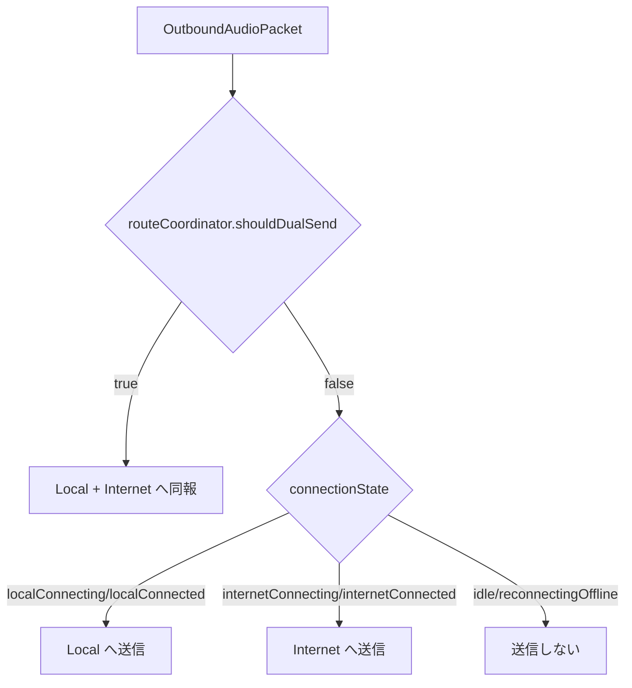

# RideIntercom 通信仕様

## 目的

本書は現行実装における通信経路、認証、招待 URL、送受信データ、経路切替の考え方を定義する。  
通信がどのような背景と方針で設計され、正常系と異常系でどう振る舞うかを、画面や診断表示と対応づけて記録する。

## 適用範囲

| 区分 | 内容 |
|---|---|
| Local | `MultipeerLocalTransport` による MultipeerConnectivity 通信 |
| Internet | `InternetTransport` + `URLSessionInternetTransportAdapter` または `LoopbackInternetTransportAdapter` |
| 認証 | `HandshakeMessage` による group secret ベースの MAC 検証 |
| 招待 | `rideintercom://join?token=...` の URL 招待 |
| 非対象 | サーバー API 詳細、QR 表示方式、共有シート以外の配布 UI 詳細 |

## 背景と基本方針

| 項目 | 内容 |
|---|---|
| 背景 | 山岳や移動体では圏外、不安定、近距離優位の状況があるため、Local を優先しつつ Internet へ退避できる構成が必要 |
| 目的 | 通話継続性を最大化しつつ、誤グループ接続と未認証音声受理を防ぐ |
| 優先経路 | Local |
| 方針 | Local が使える間は Local を優先し、Local が不成立または切断したときに Internet を使う |
| 意図 | 音声遅延とネットワーク依存を最小化しながら、切断時の無音時間を短くする |
| 異常系の考え方 | 経路失敗を即クラッシュや全停止に結びつけず、別経路や待機状態へ遷移して通話継続可能性を残す |

## 通信レイヤ構成

| レイヤ | 実装 | 役割 | 意味 |
|---|---|---|---|
| ViewModel 統合 | `IntercomViewModel` | 接続状態管理、イベント集約、UI 反映 | UI と通信状態の接続点 |
| 経路制御 | `RouteCoordinator` | Local 優先、Internet フォールバック、Local 再優先 | 経路方針の中心 |
| Local | `MultipeerLocalTransport` | MC advertise/browse, invite, handshake, 音声送受信 | 近距離経路 |
| Internet | `InternetTransport` | adapter 経由の音声/制御送受信 | 代替広域経路 |
| Internet adapter | `URLSessionInternetTransportAdapter`, `LoopbackInternetTransportAdapter` | WebSocket またはローカル代替経路 | Internet 実体の切替点 |
| ペイロード | `AudioPacketSequencer`, `AudioPacketCodec`, `MultipeerPayloadBuilder` | envelope 化、符号化、制御 payload 化 | 音声/制御の共通表現 |
| 認証/暗号 | `HandshakeService`, `PacketCryptoService` | MAC 検証、AES-GCM 暗号化 | 同一グループ確認と秘匿性確保 |

## 接続開始仕様

### グループ選択時

| 項目 | 動作 | 意味・意図 |
|---|---|---|
| `selectGroup` | 既存接続を切断し、状態を初期化して `startLocalStandby()` を呼ぶ | グループ切替時に前回状態を持ち越さない |
| `startLocalStandby()` | 音声未開始のまま `localTransport.connect(group:)` を呼び、近距離ピア待受だけを開始 | すぐ話し始めなくても Local 発見は先行させる |
| 接続表示 | `connectionState = .idle` のまま。`localNetworkStatus` は MC イベントで更新 | 「待受」と「通話接続済み」を分離して表現する |

### Connect 押下時

| 項目 | 動作 | 意味・意図 | 異常系の考え方 |
|---|---|---|---|
| 音声開始 | `startAudioPipelineIfNeeded()` が成功した場合のみ継続 | 音声経路が上がらないまま接続だけ先行させない | 音声起動失敗時は接続へ進まずエラー表示を優先 |
| ルート初期化 | `routeCoordinator.connectLocal()` | Local 優先の接続試行を開始する | なし |
| 接続状態 | `connectedPeerIDs` が空なら `localConnecting`、存在すれば `localConnected` | 相手の有無で状態を分ける | なし |
| Local connect 再利用 | `localNetworkStatus` が `idle` または `unavailable` の場合のみ `localTransport.connect(group:)` を再実行 | 不要な再接続を抑える | Local が既に動作中なら再実行しない |

## 経路選択仕様

### 基本方針

| 項目 | 現行仕様 | 意味・意図 |
|---|---|---|
| 優先経路 | Local | 低遅延、近距離自律動作を優先する |
| Local 失敗時 | `internetAvailable == true` なら Internet へ移行 | 通話継続性を優先する |
| Internet 失敗時 | `reconnectingOffline` | 代替経路もない状態を明示する |
| Internet 利用中の Local 再優先 | `RouteCoordinator` が Local candidate を検知した場合に probe を行う | 戻せる時は Local に戻す |
| dual send | `handoverToLocal` 中のみ有効 | 切替瞬間の音切れを最小化する |

### RoutePolicy 判定値

| 指標 | しきい値 | 意味 |
|---|---|---|
| `peerCount` | `>= expectedPeerCount` | 必要 peer 数が揃っているかを見る |
| `rttMilliseconds` | `<= 180` | 会話可能な遅延を維持できるかを見る |
| `jitterMilliseconds` | `<= 60` | 再生の揺らぎが大きすぎないかを見る |
| `packetLossRate` | `<= 0.10` | 受信欠落が許容範囲かを見る |
| `probeWindow` | `7.5 sec` | Local 再優先判断の観測期間 |
| `dualSendWindow` | `1.0 sec` | 音切れを避ける二重送信期間 |

### 送信先選択

補足:

| 項目 | 内容 |
|---|---|
| 背景 | 切替直後は経路状態が揺れるため、単純な瞬間切替だと無音時間が出やすい |
| 方針 | `handoverToLocal` 中だけ二重送信し、受信側で重複排除する |
| 意図 | 経路切替を利用者へ意識させない |

## Local 通信仕様

### discover / invite

| 項目 | 仕様 | 背景・意味 |
|---|---|---|
| Service type | `ride-intercom` | MC 上の識別子 |
| discoveryInfo | `LocalDiscoveryInfo.makeDiscoveryInfo(for:)` が生成する `groupHash` 系情報 | 広告段階で同一グループ候補を絞る |
| 発見時の一致判定 | `LocalDiscoveryInfo.matches(info, credential:)` | 他グループ誤接続を減らす |
| 不一致時 | `localNetworkStatus = .rejected(.groupMismatch)` | 不一致を単なる未発見ではなく拒否理由として扱う |
| 招待時 | 一致した peer に対して `browser.invitePeer(... timeout: 10)` | 同一グループ候補だけ招待する |

### Local の認証/切断

| 項目 | 仕様 | 意味・意図 | 異常系の考え方 |
|---|---|---|---|
| MC 接続時 | 接続相手へ `ControlMessage.handshake` を reliable 送信 | 接続後にも同一グループ確認を行う | 発見一致だけで信用しない |
| handshake 検証 | `HandshakeRegistry.accept` | 秘密情報を持つ相手だけを認証する | なし |
| 検証成功 | `TransportEvent.authenticated(peerIDs:)` を送出 | 音声受理可能な相手として登録する | なし |
| 検証失敗 | `localNetworkStatus = .rejected(.handshakeInvalid)` とし `cancelConnectPeer` | 未認証相手を残さない | 即切断する |
| 未認証 peer の音声 | 受理しない | 音声受理と接続成立を分離する | 接続済みでも音は通さない |

### Local の暗号化

| 項目 | 仕様 | 意味 |
|---|---|---|
| 音声 payload | `PacketCryptoService.encrypt` / `decrypt` | Local 音声の秘匿化 |
| 鍵 | `GroupAccessCredential.symmetricKey` | グループ secret 由来鍵 |
| 制御 payload | JSON (`ControlPayloadEnvelope`)。音声とは別経路 | 制御と音声を分離し扱う |

## Internet 通信仕様

### adapter 選択

| 条件 | 使用 adapter | 意味 |
|---|---|---|
| `RIDEINTERCOM_INTERNET_URL` が `ws://` または `wss://` | `URLSessionInternetTransportAdapter` | 外部接続先を使う Internet 経路 |
| 上記以外 | `LoopbackInternetTransportAdapter` | 代替/検証用のローカル経路 |

### URLSessionInternetTransportAdapter

| 項目 | 仕様 | 意味・意図 | 異常系の考え方 |
|---|---|---|---|
| 接続先 | `baseURL?groupID={uuid}` | groupID を URL クエリに載せてグループを識別する | なし |
| 接続完了扱い | WebSocket 開始直後に `connected(peerIDs: group.members.map(\.id))` を送出 | Internet 経路の接続開始を早く UI に反映する | 実 peer 実在確認とは別概念 |
| 受信形式 | `InternetWireEnvelope` (`audio` / `control`) | 音声と制御を共通 envelope で扱う | なし |
| 認証扱い | `control.handshake` を受けると `authenticated(peerIDs: [peerID])` | Internet 側も音声受理前に認証状態へ上げる | handshake 未受信なら未認証のまま |
| 受信失敗 | `linkFailed(internetAvailable: false)` | 経路断を route coordinator へ通知する | Local へ戻るか offline へ落とす判断材料にする |

補足:

| 項目 | 内容 |
|---|---|
| 背景 | Internet 側は Local のような近接 discovery を持たない |
| 意味 | 接続先 URL と `groupID` がグループ識別の主要材料になる |

## 招待 URL 仕様

### 生成

| 項目 | 仕様 | 意味・意図 |
|---|---|---|
| 形式 | `rideintercom://join?token={base64url(JSON)}` | アプリ内で直接受理できる共有形式 |
| 本体 | `GroupInviteToken` | グループ参加に必要な最小情報をまとめる |
| 期限 | `issuedAt + 7 days` | 古い招待の誤利用を抑える |
| 共有 UI | Call 画面の `ShareLink` | 通話文脈から相手招待へつなげる |

### token フィールド

| フィールド | 型 | 内容 | 意味 |
|---|---|---|---|
| `version` | `Int` | 現在は `1` 固定 | 形式互換性の識別 |
| `groupID` | `UUID` | 参加先グループ | 接続先識別 |
| `groupName` | `String` | グループ表示名 | 受理時表示用 |
| `groupSecret` | `String` | 共有 secret | 認証/暗号化の根拠 |
| `inviterMemberID` | `String` | 招待元メンバー ID | 招待元識別 |
| `issuedAt` | `TimeInterval` | 発行時刻 | 有効期間判断の起点 |
| `expiresAt` | `TimeInterval?` | 失効時刻 | 期限切れ判断 |
| `signature` | `String` | `groupSecret` を用いた HMAC-SHA256 | 改ざん検知 |

### 受理

| 項目 | 仕様 | 意味・意図 | 異常系の考え方 |
|---|---|---|---|
| 入口 | `ContentView.onOpenURL` | 外部招待の統一入口 | なし |
| デコード | `GroupInviteTokenCodec.decodeJoinURL` | URL から token を復元する | 復元失敗は受理しない |
| 検証 | version, signature, expiresAt | 改ざんや期限切れを弾く | 不正 token は参加状態へ進めない |
| 受理後 | Keychain に secret 保存、グループを保存/選択、`inviteStatusMessage = "JOINED {groupName}"` | 参加完了を通話文脈へ反映する | なし |
| 作成されるメンバー | ローカルメンバー + `Inviter` 表示名の招待元メンバー | 受理直後から最低限の相手情報を持てるようにする | なし |

## データ仕様

### HandshakeMessage

| フィールド | 内容 | 意味 |
|---|---|---|
| `groupHash` | `groupID + secret` 由来の SHA-256 | 同一グループ識別 |
| `memberID` | 送信者メンバー ID | 相手識別 |
| `nonce` | 使い捨て文字列 | リプレイ抑止 |
| `mac` | `groupHash|memberID|nonce` を secret で HMAC-SHA256 | 真正性確認 |

### AudioPacketEnvelope

| フィールド | 内容 | 意味 |
|---|---|---|
| `groupID` | グループ識別 | 受理対象判定 |
| `streamID` | ストリーム識別 | 重複排除、系列追跡 |
| `sequenceNumber` | 連番 | 欠落、順序、重複判定 |
| `sentAt` | 送信時刻 | jitter / 受理時刻補正 |
| `kind` | `voice` または `keepalive` | 再生対象か維持信号かの区別 |
| `encodedVoice` | 音声 payload。現行送信 codec は実質 PCM | 音声本体 |
| `transmitMetadata` | requested / encoded codec と fallback 情報 | 実送信事情の診断情報 |

### ControlMessage

| 種別 | 送信モード | 用途 | 意味 |
|---|---|---|---|
| `keepalive` | unreliable | 接続維持 | 無音時も経路を維持する |
| `handshake` | reliable | Local 認証 | 音声受理前の認証成立に使う |
| `peerMuteState` | reliable | 相手のミュート状態同期 | UI と送話状態の整合を取る |

## 受信受理条件

| 項目 | 現行仕様 | 意味・意図 | 異常系の考え方 |
|---|---|---|---|
| group 一致 | `ReceivedAudioPacketFilter(groupID:)` が一致する envelope のみ受理 | 他グループ音声を混入させない | 不一致は破棄する |
| Local 認証 | `authenticatedPeerIDs` に存在する peer のみ音声受理 | 接続と音声受理を分離する | 未認証音声は破棄する |
| 重複排除 | `streamID + sequenceNumber` ベース | dual send や再送相当を整理する | 先着採用で重複は捨てる |
| 復号失敗 | 破棄 | 不正または破損 payload を通さない | 復号失敗を再生に回さない |
| keepalive | 音声再生はしない | 接続維持情報と音声本体を区別する | 無音 packet として扱う |

## 異常時の設計方針

| 事象 | 方針 |
|---|---|
| Local browse / advertise 開始失敗 | `localNetworkStatus` に理由を反映し、Internet 可用性があれば代替経路判断へ回す |
| Local link fail かつ Internet 利用可 | `connectionState` を Internet 側へ進め、通話継続を優先する |
| Local link fail かつ Internet 利用不可 | `reconnectingOffline` とし、再接続待機状態を保つ |
| handshake 不一致 | 受理せず切断し、拒否理由を保持する |
| metadata 不整合 | 診断に記録しつつ、可能な範囲で通話継続を優先する |

## 設定値との意味対応

参照元: [設定値一覧](設定値一覧.md)

| 項目 | 通信上の意味 |
|---|---|
| 送信 codec | payload の encoded codec と metadata 記録内容に影響する |
| HE-AAC 品質 | HE-AAC 系の符号化品質概念に対応する |
| VAD 閾値 | voice / keepalive の発行頻度に影響する |
| ローカルマイクミュート | voice 送出停止と `peerMuteState` 同期に影響する |
| 入力デバイス | 送信元音声の性質に影響する |
| 出力デバイス | 通信経路ではなく再生経路にのみ影響する |
| Sound Isolation | 入力信号特性を変え、VAD と送信音声内容に影響する |

## 実装トレーサビリティ

| 領域 | 実装 |
|---|---|
| Local 通信 | `RideIntercom/RideIntercom/MultipeerLocalTransport.swift` |
| Internet 通信 | `RideIntercom/RideIntercom/URLSessionInternetTransportAdapter.swift`, `RideIntercom/RideIntercom/IntercomCore.swift` |
| 招待 / 認証 / 暗号 | `RideIntercom/RideIntercom/IntercomCore.swift` |
